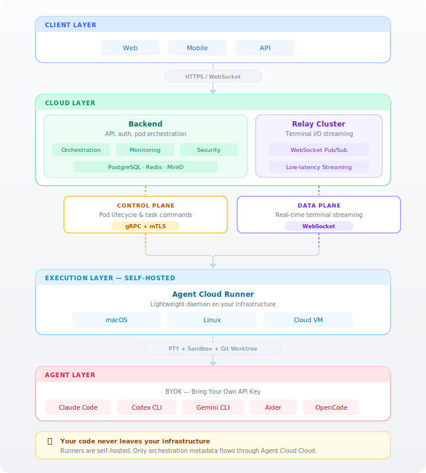

<p align="center">
  
</p>

<h1 align="center">Do Worker</h1>

<h3 align="center">Where teams scale beyond headcount.</h3>

<p align="center">
  The AI Agent Workforce Platform.<br/>
  Run a hundred AI agents across your own machines — and command them all from one console.
</p>

<p align="center">
  <a href="https://agentsmesh.ai">Website</a> ·
  <a href="https://agentsmesh.ai/docs">Docs</a> ·
  <a href="#quick-start">Quick Start</a> ·
  <a href="https://github.com/l8ai-cn/DoWorker">GitHub</a> ·
  <a href="https://discord.gg/3RcX7VBbH9">Discord</a> ·
  <a href="https://x.com/agentsmeshai">X</a> · <a href="https://x.com/stone0dong">X (founder)</a> ·
  <a href="https://www.linkedin.com/company/agentsmesh">LinkedIn</a>
</p>

<p align="center">
  <a href="https://github.com/l8ai-cn/DoWorker/actions/workflows/ci.yml"></a>
  <a href="https://github.com/l8ai-cn/DoWorker/blob/main/LICENSE"></a>
  <a href="https://hub.docker.com/u/agentsmesh"></a>
</p>

<p align="center">
  <a href="https://youtu.be/FZrUO0tim0U">
    
  </a>
</p>

---

## The problem: one operator, a hundred agents

AI coding agents have made individual engineers wildly productive — but individual productivity has a ceiling. The next 10x isn't a smarter agent; it's **running many agents at once**, and directing them like a team.

That ambition breaks the moment you try it for real:

- A hundred agents won't fit on one laptop.
- Nobody can babysit a hundred terminals.
- Each agent needs its own clean, isolated workspace — or they corrupt each other's state.
- Long-running agents stall, get stuck, and silently die.
- Agents working in isolation never compound into a team.

What's missing isn't the agent. It's the **control layer** that turns one operator into the director of an agent workforce — the layer that schedules agents onto machines, isolates them, keeps them alive, lets them collaborate, and puts all of it on one screen.

**Do Worker is that layer.**

## From problem to platform

Every part of Do Worker exists to answer one question: *how does a single person reliably run, watch, and steer a hundred agents?* Each capability is the direct answer to a wall you hit when you scale.

| The wall you hit | What Do Worker gives you |
|---|---|
| 100 agents won't run on one machine | **Runner fleet** — install self-hosted runners across any number of machines. Each advertises its capacity (`max_concurrent_pods`), and agents are scheduled onto the runner you pick or an available one from the pool. Your code never leaves your infrastructure. |
| Every agent needs a clean, isolated environment | **Workspace isolation** — each agent runs in its own pod with a dedicated Git worktree sandbox (`sandboxes/{pod}/workspace/`), private credentials, and its own branch. Concurrent agents never step on each other. |
| You can't watch a hundred terminals | **One web console, every screen** — paginated pod sidebar, multi-pane workspace, and real-time terminal streaming let one person hold many agents in view. |
| Long-running agents stall and need babysitting | **Autopilot** — a control agent watches a pod and sends the next instruction the moment it goes idle, with iteration caps, decision history, and human takeover/handback. Self-healing, unattended runs. |
| Agents working alone don't compound | **Mesh & Channels** — bind pods together, let them talk over channels with `@mentions`, and watch the collaboration topology update in real time. |

The rest is plumbing built so that chain holds up under load: a **control-plane / data-plane split** — orchestration over gRPC with mTLS, terminal bytes over a stateless Relay cluster — so the backend never bottlenecks on PTY traffic, no matter how many agents are streaming at once.

## Core concepts

- **AgentPod** — one agent's isolated execution environment: a PTY terminal, a Git worktree sandbox, and a real-time output stream.
- **Runner** — a self-hosted daemon you install on your own machines. It connects to the backend over gRPC+mTLS and spawns pods. Register as many as you need; pods schedule across the fleet.
- **Workspace** — the per-pod sandbox: an isolated Git worktree plus private credentials, so concurrent agents never collide and every run is recoverable.
- **Autopilot** — autonomous, self-healing control of a pod by a *control agent*, with iteration limits, decision history, and human takeover at any point.
- **Mesh & Channel** — the collaboration fabric: pods bound into a topology, communicating over channels with `@mentions`.
- **Ticket** — a unit of work on a Kanban board, bindable to a pod with progress and MR/PR tracking.

## Architecture

Do Worker separates the **control plane** from the **data plane**: orchestration commands travel over gRPC with mTLS, while terminal I/O streams through a stateless Relay cluster. The backend never touches a single PTY byte — which is what lets the fleet scale.

<p align="center">
  
</p>

**Server-side (Go)**

| Component | Role |
|-----------|------|
| **Backend** | API server (Gin + GORM) — auth, org/team/user, pod lifecycle, tickets, billing, and the PKI that issues runner certs |
| **Relay** | WebSocket relay for the terminal data plane — low-latency pub/sub between runners and clients |
| **Runner** | Self-hosted daemon — connects to the backend (gRPC+mTLS), spawns isolated PTY pods that run the actual agents |

**Client-side**

| Component | Role |
|-----------|------|
| **Rust Core** | Business-logic SSOT — shared crates compiled to WASM for web. One cache, one set of services. |
| **Web** | Next.js console — terminal, Kanban, real-time mesh topology |
| **Web-Admin** | Internal admin console — user/org/runner management, audit logs |

## Getting Started

The fastest way to use Do Worker is the hosted service at **[agentsmesh.ai](https://agentsmesh.ai)** — sign up, connect your Git provider, and start running agents in minutes. Bring your own AI API keys (**BYOK**): no usage caps, full cost control.

### 1. Install a Runner

The Runner is a lightweight daemon that runs on your machine and executes AI agents locally. Your code stays on your infrastructure. Install one per machine you want in the fleet.

```bash
curl -fsSL https://agentsmesh.ai/install.sh | sh
```

> See the [Runner README](runner/) for more installation options (deb, rpm, Windows, etc.)

### 2. Login

```bash
agentsmesh-runner login
```

This opens your browser to authenticate. For headless environments (SSH, remote server):

```bash
agentsmesh-runner login --headless
```

For self-hosted deployments, add `--server`:

```bash
agentsmesh-runner login --server https://your-server.com
```

### 3. Run

```bash
agentsmesh-runner run
```

Or install as a system service for always-on operation:

```bash
agentsmesh-runner service install
agentsmesh-runner service start
```

Once the runner is online, create an **AgentPod** from the web console and start putting agents to work.

## Quick Start

Run the whole stack locally with one command.

```bash
git clone https://github.com/l8ai-cn/DoWorker.git
cd DoWorker
bazel run //deploy/dev:up
```

This starts the full stack: PostgreSQL, Redis, MinIO, Backend, Relay, Traefik, and the Next.js frontend with hot reload.

**Access (main worktree / offset 0):**

| Service | URL |
|---------|-----|
| Web Console | http://localhost:10007 |
| API | http://localhost:10000/api |
| Admin Console | http://localhost:10011 |

**Test Accounts:**

| Role | Email | Password |
|------|-------|----------|
| User | dev@agentsmesh.local | AdminAb123456 |
| Admin | admin@agentsmesh.local | Ab123456 |

> Ports are dynamically allocated per worktree. Check `deploy/dev/.env` for actual values.

<details>
<summary><strong>Manual Setup</strong></summary>

**Prerequisites:** Bazel (bazelisk), Go 1.25+, Node.js 20+, pnpm, Docker, ibazel

```bash
# 1. Start infrastructure + host services
bazel run //deploy/dev:up

# 2. Tail logs
tail -f deploy/dev/runtime/backend/backend.log
tail -f deploy/dev/web.log

# Low-memory alternative (no ibazel):
# cd deploy/dev && ./dev-lite.sh
```

</details>

<details>
<summary><strong>Production Deployment</strong></summary>

Docker images are published to Docker Hub on every push to `main`:

```
agentsmesh/backend:sha-xxxxxxx
agentsmesh/web:sha-xxxxxxx
agentsmesh/web-admin:sha-xxxxxxx
agentsmesh/relay:sha-xxxxxxx
```

Tagged releases (`v*`) get semver tags:

```
agentsmesh/backend:1.0.0
agentsmesh/backend:1.0
```

See [deploy/selfhost/](deploy/selfhost/) for the self-hosted deployment guide.

</details>

## Supported Agents

Any terminal-based agent works. The built-ins:

| Agent | Provider | Description |
|-------|----------|-------------|
| [Claude Code](https://docs.anthropic.com/en/docs/agents-and-tools/claude-code/overview) | Anthropic | Autonomous AI coding agent |
| [Codex CLI](https://github.com/openai/codex) | OpenAI | OpenAI's code generation CLI |
| [Gemini CLI](https://github.com/google-gemini/gemini-cli) | Google | Google Gemini CLI |
| [Aider](https://github.com/Aider-AI/aider) | Open Source | AI pair programming in the terminal |
| [OpenCode](https://github.com/opencode-ai/opencode) | Open Source | Open source AI coding tool |
| Custom | Any | Any terminal-based agent |

## Tech Stack

| Layer | Technology |
|-------|-----------|
| Backend | Go (Gin + GORM) |
| Client Core | Rust → WASM (web) — shared business logic |
| Web | Next.js (App Router) + TypeScript + Tailwind |
| Database | PostgreSQL + Redis |
| Storage | MinIO (S3-compatible) |
| API | REST + gRPC (bidirectional streaming) |
| Security | mTLS for runner connections, JWT for web auth |
| Real-time | gRPC streaming (Runner ↔ Backend), WebSocket (Relay ↔ Client) |
| Reverse Proxy | Traefik |

## Project Structure

```
DoWorker/
├── backend/          # Go API server
├── relay/            # Terminal relay server (Go)
├── runner/           # Self-hosted runner daemon (Go)
├── agentfile/        # AgentFile DSL
├── clients/
│   ├── core/         # Rust business-logic SSOT (WASM)
│   ├── web/          # Next.js console
│   ├── web-admin/    # Admin console (Next.js)
│   └── web-user/     # Hive / session UI
├── proto/            # Protocol Buffers definitions
├── packages/         # Shared TS packages (service-runtime, …)
├── deploy/
│   ├── dev/          # Docker Compose + host-side Bazel services
│   └── selfhost/     # Self-hosted deployment guide
├── tests/            # E2E / hive smoke suites
└── docs/             # Architecture docs and RFCs
```

## Contributing

We welcome contributions! See [CONTRIBUTING.md](CONTRIBUTING.md) for guidelines.

- [Code of Conduct](CODE_OF_CONDUCT.md)
- [Security Policy](SECURITY.md)

## License

[Business Source License 1.1](LICENSE) (BSL-1.1)

- **Change Date:** 2030-02-28
- **Change License:** GPL-2.0-or-later

The BSL allows you to use, copy, and modify the software for non-production purposes. Production use requires a commercial license until the change date, after which the software becomes available under GPL-2.0-or-later. See [LICENSE](LICENSE) for the full terms and additional use grant.
