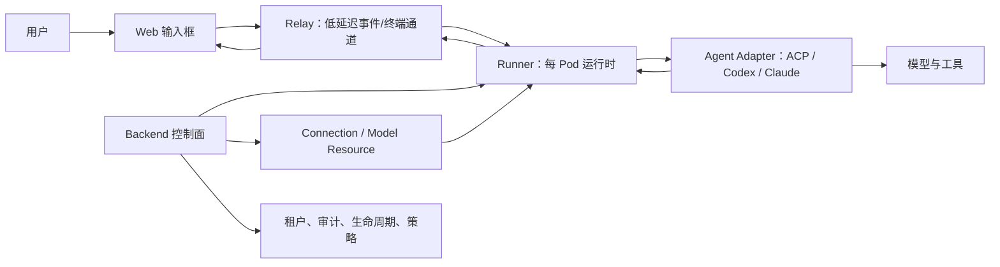

# AI 对话能力实现方式对比

> 对比对象：AgentsMesh、Codex CLI、Claude Code、Gemini CLI、OpenCode。
> 证据日期：2026-07-10。外部结论仅使用各项目官方文档或官方源码。

## 结论摘要

五个项目的产品边界不同。Codex CLI、Claude Code、Gemini CLI 和
OpenCode 以本地 Agent 会话为中心，直接控制本机工具运行时；AgentsMesh
是多租户控制平面，必须在浏览器、Relay、Runner、Agent 协议、资源凭据和
组织授权之间仍保持连贯对话体验。

AgentsMesh 的核心优势是异构 Agent 归一化。Runner 通过统一的 `Transport`
接口兼容标准 ACP JSON-RPC、Claude stream-json 和 Codex app-server；Web
以同一时间线呈现消息、思考、工具、计划、日志、授权、图片和会话状态。
代价是归一化边界会压缩 Agent 原生事件，未进入通用模型的语义无法被统一
回放或治理。

当前 `feat/worker-config-lifecycle` 已提交内容提供了资源治理基础：
加密 Provider Connection、可选择的 Model Resource、个人/组织授权、
健康状态、审计记录和 Connect RPC。但它尚未将 `model_resource_id` 接入
Worker 创建和运行时凭据解析，不能被表述为完整的统一 AI 资源交付。

详细的资源分支评估与实施路线见
[AI 对话资源治理实施附录](ai-dialogue-resource-governance-roadmap.md)。

## 能力矩阵

| 维度 | AgentsMesh | Codex CLI | Claude Code | Gemini CLI | OpenCode |
| --- | --- | --- | --- | --- | --- |
| 产品边界 | 浏览器、控制面、Runner | 本地编码 Agent | 本地编码 Agent | 本地编码 Agent | 本地/服务化 Agent |
| 会话身份 | Pod Key + Agent Session ID | 持久化 Codex 线程 | 本地持久化会话 | 项目会话 | 服务端 Session |
| 事件模型 | 归一化时间线 + Relay 原始通道 | app-server JSON-RPC、exec JSONL | stream-json | 交互 UI 或 Headless JSON/流 | REST/事件流、ACP |
| 工具授权 | 通用待授权模型 | Sandbox 与 approval policy | 工具级 permission rule | policy/confirmation | permission rule 与 UI |
| 多模态输入 | 文本 + 可持久图片引用 | 图片输入 | 图片/文件输入 | Gemini 原生多模态 | 图片/文件附件 |
| 扩展协议 | ACP + Codex/Claude 专用 Adapter | MCP、skills、plugins | MCP、hooks、skills、plugins | MCP、extensions | MCP、ACP、plugins |
| 组织治理 | 租户、Runner mTLS、审计、资源所有权 | 主要依赖本机/账号策略 | 主要依赖本机/团队策略 | 主要依赖本机/账号策略 | 项目/服务策略 |
| 模型凭据 | Connection -> Resource -> Runtime | 账号/API Key 配置 | 账号/API Key 配置 | Google Auth/API Key/模型参数 | Provider/模型配置 |

## 架构差异

本地 CLI 将大部分节点收敛到一个进程，低延迟且实现面小，但多用户授权、
远程恢复、凭据委派和跨 Agent 可观测性通常交由宿主环境。AgentsMesh 为
显式拥有这些责任而承担分布式系统复杂度。

## AgentsMesh：现状

### 对话与执行轨迹

- `runner/internal/acp/transport.go` 定义初始化、握手、建会话、文本/图片
  输入、授权响应、取消、控制请求、读事件和关闭的统一生命周期。
- `runner/internal/acp/handler.go` 将 ACP 更新翻译为消息流、思考、工具状态/
  结果、计划、配置、授权和日志；图片在进入历史前被归一化。
- `clients/core/crates/state/src/acp_session.rs` 是客户端状态 SSOT，负责流式
  拼接、完成封存、用户回显去重、容量限制、工具/授权/配置/会话状态。
- `AcpActivityStream.tsx` 按时间渲染消息、工具、思考和日志；
  `AcpPromptInput.tsx` 提供文本、图片、权限模式和中断操作。
- `codexItemsToAcpSnapshot.ts` 将持久化 Codex 项目转换为相同回放结构，使
  直播与历史会话共享一套 UI。

### 优势

1. 协议隔离清晰：兼容 Agent 可走 ACP，Codex/Claude 保留各自 Adapter。
2. Backend 不承载 PTY 字节；Relay 负责数据面，Backend-to-Runner gRPC
   负责生命周期和授权。
3. 授权、取消、计划、工具结果、思考和图片均为一等对话状态，不依赖终端
   文本正则解析。
4. Rust Core 将业务状态从 React/Zustand 的直接修改路径中移出，降低重连后
   前端状态分叉。

### 风险

1. `NewTransport` 对未知 Adapter 默认改走 ACP；生产控制面应改为显式配置
   错误，避免协议注册失效被静默掩盖。
2. 通用事件模型小于各 Agent 原生模式；当需要审计回放或恢复特有语义时，
   应同时保留可访问控制的原始事件账本。
3. Core 的实时缓存有容量上限；持久历史必须有后端游标、事件序号和幂等
   合同，不能依赖浏览器内存恢复。
4. 通用“允许/拒绝”不足以支撑企业治理。策略决策应绑定组织、Actor、Pod、
   工具、参数、仓库、Runner 与资源范围，并持久化决策依据。

## 四类本地实现

### Codex CLI

Codex 同时提供交互 CLI 和类型化集成面：app-server 提供 JSON-RPC
线程/会话操作，非交互执行可输出 JSONL 事件。它覆盖线程恢复、Sandbox 与
审批、图片输入、MCP、skills/plugins 和多 Agent 编排。

对 AgentsMesh 的启示是保留 Codex 原生项的原始记录，并仅把稳定的公共事件
投影到共享 UI；不要因 UI 归一化丢失诊断与回放能力。

### Claude Code

Claude Code 以本地会话为中心，提供 resume/continue、stream-json 自动化
输出、工具权限与 settings、MCP、hooks、skills、plugins 和图片/文件输入。
其强项是将对话体验与工具执行策略分离。

AgentsMesh 应将“会话状态”和“执行策略”拆开：同一 Prompt 在不同组织、
仓库、Runner 类型或 Loop 场景下可具有不同有效策略，且必须在事件流和审计
记录中可见。

### Gemini CLI

Gemini CLI 强调项目上下文：项目会话、交互命令、Headless 机器可读输出、
Gemini 原生多模态、MCP 与工具确认策略共存于 CLI 进程。

AgentsMesh 可采用其项目上下文思想，但不能沿用本地存储假设。持久对象应为
`conversation_run`，关联 Pod、工作区版本、选定模型资源、Agent Adapter、
权限策略版本和事件序号，以支持准确回放、诊断和定时执行。

### OpenCode

OpenCode 将 Session 与 Message 暴露为可寻址对象，程序客户端消费事件，
并以 ACP 连接外部 Agent；同时支持 provider/model、MCP、plugins、权限和
附件。它的关键优势是把用户对话 API 做成显式服务边界而非附带终端文本。

AgentsMesh 应借鉴该服务边界，但保留控制面/Runner 数据面的分离。公开对话
API 默认只返回规范事件和能力元数据，绝不默认返回凭据或原始终端帧。

## 推荐目标

### 规范事件信封

使用追加式事件信封：`conversation_id`、`turn_id`、`sequence`、时间、
Actor、Adapter、事件类型、规范载荷，以及可选加密/脱敏原始载荷引用。UI
消费规范事件；诊断在授权后取原始事件。每条命令携带幂等键，重连按序号游标
续传。

### 会话状态机

`created -> initializing -> idle -> processing -> waiting_permission ->
processing -> completed | interrupted | failed -> archived`

只允许持久化状态迁移。授权请求必须先记录工具提案和策略决策，再恢复 Runner
执行；取消是有确认事件的命令，不能只是 UI 层 best-effort 操作。

## 证据

仓库证据：

- `runner/internal/acp/{transport.go,handler.go,types.go}`
- `clients/core/crates/state/src/acp_session.rs`
- `clients/web/src/components/workspace/acp/{AcpActivityStream.tsx,AcpPromptInput.tsx}`
- `clients/web/src/lib/codexItemsToAcpSnapshot.ts`

官方证据：OpenAI Codex、Anthropic Claude Code、Gemini CLI 与 OpenCode
官方文档站点，详见本文档对应的在线引用和实施附录。
