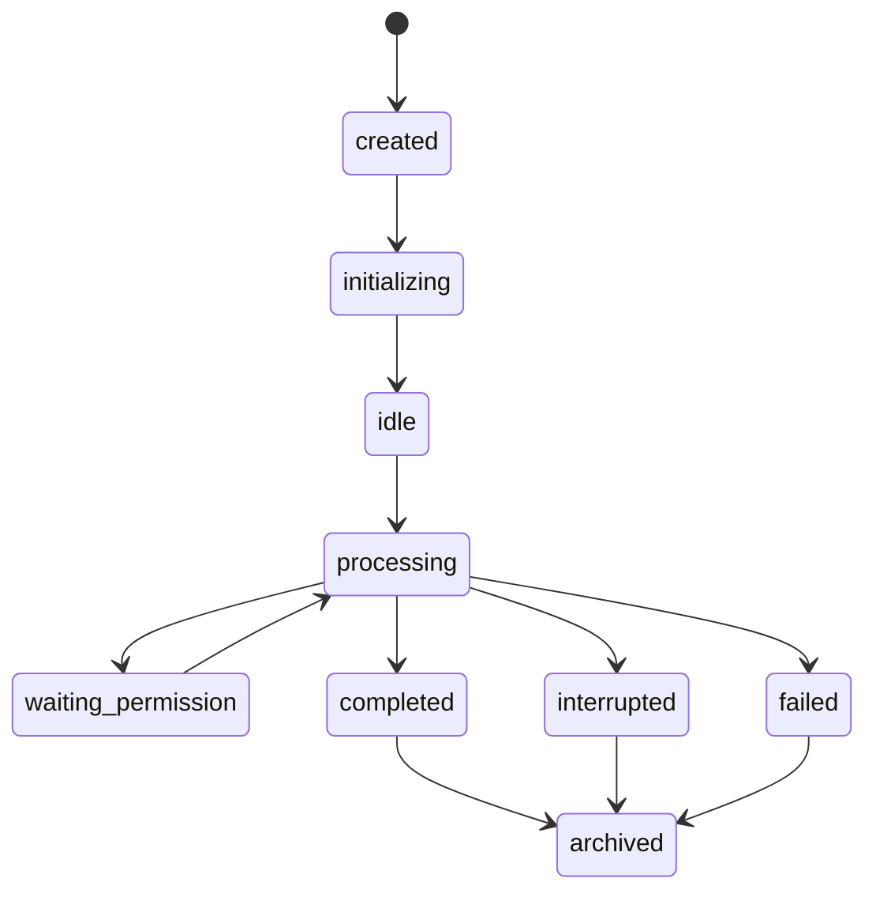

# AI 对话资源治理实施附录

> 对应主报告：[AI 对话能力实现方式对比](ai-dialogue-capability-comparison.md)。
> 本附录区分已提交代码、尚未交付范围和可验证的实施顺序。

## 当前分支评估

`feat/worker-config-lifecycle` 的 15 个已提交 AI Resource 变更已实现：

- `000190_ai_resources`：Provider Connection、Model Resource、按模态默认值、
  迁移映射、所有权触发器、identifier 约束和父子不变量。
- `backend/internal/service/airesource`：凭据加密、Endpoint 校验、个人/组织
  权限、健康状态、revision CAS、审计事件和精确资源解析。
- `proto/ai_resource/v1/ai_resource.proto`：Provider Catalog、有效资源读取、
  个人/组织 mutation、验证、默认值和安全元数据。

已提交范围未完成设计稿中的下列阶段：

1. Rust/WASM 与类型化 Web Client 接入。
2. AI Resources 设置页面、浏览器 E2E 和权限状态 UI。
3. Worker `model_resource_id` 选择、精确运行时解析及旧凭据路径移除。
4. 旧 `ai_models`/credential EnvBundle 的迁移、切换校验和清理。
5. 个人/组织授权、验证失败、无可用资源、模态过滤与多视口端到端验证。

因此，本次合并只能定位为非用户可见的后端基础：数据库和 API 面已扩展，
完整的 Worker 模型资源工作流尚未完成。

## 资源解析边界

创建 Worker 时，客户端必须提交唯一的 `model_resource_id`。服务端一次性校验：

1. 资源对用户/组织可见。
2. Connection 与 Resource 均启用。
3. 两者健康状态均为 `valid`。
4. 模态、能力和 Agent Adapter 匹配。
5. Endpoint 通过网络地址策略校验。
6. 解密凭据后仅在 Runner 边界生成临时 harness 配置。

禁止在此路径追加默认凭据、隐式主凭据或 credential EnvBundle。任何资源缺失、
未授权、不健康或不兼容都应阻断 Worker 创建并返回可操作的类型化错误。

## 优先级路线图

| 优先级 | 工作项 | 验收证据 |
| --- | --- | --- |
| P0 | Worker 精确资源解析与 fail-closed 切换 | 显式 B 必定解析 B；不可用 B 阻断；无旧凭据挂载 |
| P0 | 持久化对话事件账本 | 重连/回放保序、幂等、工具状态和授权决策 |
| P0 | 去除未知 Adapter 的默认 ACP 行为 | 错误注册导致 Pod 初始化失败且产生审计事件 |
| P1 | 资源设置页面与真实浏览器 E2E | 个人/组织 member/admin、健康、禁用、空态、异常、模态状态 |
| P1 | 集中式权限策略评估 | 每个决策可解释、可审计、可回放 |
| P2 | 保存受控访问的 Agent 原始事件 | 规范 UI 稳定且支持诊断特有 Adapter 事件 |
| P2 | 事件级用量归因 | 用量关联资源、模型、Pod、Turn、工具和组织，不伪造 quota |

## 建议状态机

授权请求写入“工具提案 + 适用策略 + 操作者决策”后才允许 Runner 恢复执行。
取消命令必须返回确认事件；网络断开不等同于取消成功。

## 证据与限制

代码证据：

- `docs/superpowers/specs/2026-07-10-unified-ai-resource-management-design.md`
- `backend/migrations/000190_ai_resources.up.sql`
- `backend/internal/service/airesource/{effective.go,credentials.go,resolve.go}`
- `backend/internal/api/connect/ai_resource/{server.go,queries.go,wire.go}`
- `proto/ai_resource/v1/ai_resource.proto`

外部对比结论的官方来源：

- OpenAI Codex: `developers.openai.com/codex`
- Claude Code: `code.claude.com/docs`
- Gemini CLI: `geminicli.com/docs`
- OpenCode: `opencode.ai/docs`
