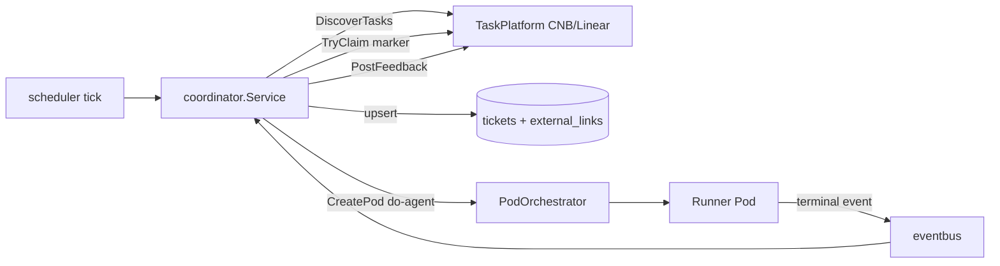
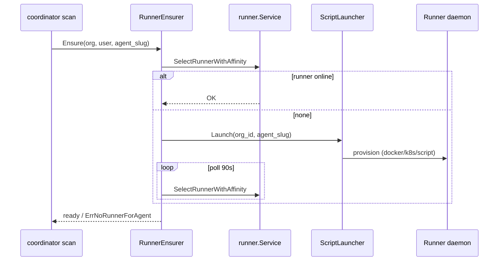

# auto-harness 整合（Coordinator）

把 auto-harness 的「任务源驱动调度引擎」原生重写进 AgentsMesh backend：定时扫描外部任务源（CNB issue / Linear）→ 落成 **Ticket** → 认领 → 经 `PodOrchestrator` 起 **do-agent** Pod → Pod 终态后把结果回写到任务源评论。复用现有 Ticket/kanban、PodOrchestrator、eventbus、CNB token 体系。

## 架构映射

| auto-harness | AgentsMesh 落点 |
|---|---|
| `platform.Driver` | `coordinator.TaskPlatform` 接口 + CNB(HTTP) / Linear(GraphQL) 实现 |
| `coordinator.Task` | 现有 **Ticket** + `ticket_external_links`（去重外部 issue） |
| `coordinator.Service.RunProject` | `backend/internal/service/coordinator` |
| `worker.Service` | `PodOrchestrator.CreatePod(AgentSlug=do-agent, TicketID, AgentfileLayer)` |
| `ExecutionRecord` | `coordinator_executions` |
| `ProjectSpec` | `coordinator_projects`（org + repository 范围） |
| `PostFeedback` | Pod 终态事件 → 回写评论 + 推进 ticket 状态 |



## 数据模型（migration 000160）

- `coordinator_projects`：org/repository 范围的配置（`platform_type`、`source_type`、`label_filter`、`claim_policy`(JSONB)、`agent_slug`、`scan_interval_seconds`、`max_concurrent`、`enabled`）。`slug` 走 `slugkit` 唯一标识规则。
- `coordinator_executions`：一次 claim→dispatch→feedback 周期，关联 `project_id` / `ticket_id` / `pod_key`，记录 `status`、`stage`、`claim_marker`、`external_id`、`feedback_status`。
- `ticket_external_links`：外部任务 → ticket 映射，`UNIQUE(organization_id, platform_type, external_id)` 保证幂等。

## 认领（claim marker）

认领 = 在 issue 下发一条带 HTML marker 的评论：

```
<!-- agentsmesh-coordinator:claim key="project=<id> task=<external_id>" -->
```

最早一条未释放的 marker 获胜；coordinator 把自己的 key 视为幂等再认领。`ticket_external_links` 在 store 层先行去重，marker 解决跨实例竞态。

## 调度与并发

- 单基准 ticker（30s）驱动所有 enabled project；每个 project 按 `scan_interval_seconds` 决定是否真正运行（匹配 `LoopScheduler` 的单实例模型）。
- 每个 tick 的派发预算 = `max_concurrent − 当前活跃 execution 数`。

## 反馈闭环

backend 订阅 eventbus 的 `pod_terminated` / `pod_status_changed`，按 `pod_key` 找 execution；非 coordinator pod（无 execution）直接返回。终态映射：`completed→succeeded`、`cancelled/terminated→cancelled`、其余 `failed`。随后 `PostFeedback` 回写评论，ticket 推进到 `in_review`（成功）或 `todo`（失败）。

## API（REST，session 鉴权）

挂在 `/api/v1/orgs/:slug/coordinator/projects`（`RegisterOrgScopedRoutes`）：

| 方法 | 路径 | 说明 |
|---|---|---|
| GET | `/coordinator/projects` | 列出项目 |
| POST | `/coordinator/projects` | 新建（校验 repository 属于 org） |
| GET | `/coordinator/projects/:id` | 详情 |
| PATCH | `/coordinator/projects/:id` | 改名/标签/间隔/并发/启停 |
| DELETE | `/coordinator/projects/:id` | 删除 |
| GET | `/coordinator/projects/:id/executions` | 执行记录 |
| POST | `/coordinator/projects/:id/run` | 立即扫描一次 |

> 设计取舍：未走 proto + Connect（避免多语言 codegen 链），coordinator 是 web-only 管理面，无 Rust-core 镜像，前端经 `lightFetch`（localStorage Bearer）直连 REST。

## Web

- 路由 `clients/web/src/app/(dashboard)/[org]/automation/page.tsx`，侧栏 `Automation` 入口（`stores/ide.ts` 的 `ACTIVITIES`）。
- 组件 `clients/web/src/components/coordinator/`：项目列表 + 新建对话框（选 repository、label 过滤、扫描间隔）、执行看板（按 status 分列）、Run now / Pause / Resume / Delete。
- store `clients/web/src/stores/coordinator.ts`，REST client `clients/web/src/lib/api/coordinatorApi.ts`。
- 任务本身仍在现有 `/[org]/tickets` kanban 查看（coordinator 创建的 ticket 自动出现）。

## 凭据

CNB / Linear 走 HTTP，不装 CLI。用户在 Settings 配 provider API key，coordinator 经
`user.GetDecryptedProviderTokenByTypeAndURL(userID, providerType, baseURL)` 取 token（platform factory 按 repository 的 `imported_by_user_id` 解析）。

## Runner 自动创建（auto-harness 对齐）

auto-harness 在派发前会 `CreateInstance` 动态起 worker；AgentsMesh coordinator 在 `RunProject` 扫描前调用 **RunnerEnsurer**，无在线 runner 时走可插拔 **RunnerLauncher** 再轮询上线（默认 90s / 2s）。

| 组件 | 路径 |
|---|---|
| `RunnerEnsurer` | `backend/internal/service/coordinator/runner_ensure.go` |
| `DockerLauncher` | `backend/internal/service/coordinator/runner_launcher_docker.go` |
| `K8sLauncher` | `backend/internal/service/coordinator/runner_launcher_k8s.go` |
| `ScriptLauncher` | `backend/internal/service/coordinator/runner_launcher_script.go` |
| dev compose 脚本（legacy） | `deploy/dev/ensure_coordinator_runner.sh` |

**`COORDINATOR_RUNNER_LAUNCHER`**

| 值 | 行为 |
|---|---|
| `docker` | Docker 拉起：compose 模式或 `docker run` |
| `k8s` / `kubernetes` | 渲染 Pod manifest + `kubectl apply` |
| `/path/to/script.sh` | 外部脚本（argv: org_id, agent_slug） |
| 未设置 | 无 runner 时直接 `ErrNoRunnerForAgent` |

**共享容器环境**

| 变量 | 说明 |
|---|---|
| `COORDINATOR_RUNNER_IMAGES` | `agent_slug=image` 映射，逗号分隔；docker run / k8s 必填 |
| `COORDINATOR_RUNNER_BACKEND_URL` | 容器内 BACKEND_URL |
| `COORDINATOR_RUNNER_GRPC_ENDPOINT` | 容器内 GRPC_ENDPOINT |
| `COORDINATOR_RUNNER_RELAY_BASE_URL` | 容器内 RELAY_BASE_URL |
| `COORDINATOR_RUNNER_ORG_SLUG` | Runner 注册 org |
| `COORDINATOR_RUNNER_NODE_ID_PREFIX` | 默认 `coord-runner-` |
| `COORDINATOR_RUNNER_MAX_CONCURRENT_PODS` | 默认 `10` |

**Docker 专用**

| 变量 | 说明 |
|---|---|
| `COORDINATOR_RUNNER_DOCKER_BINARY` | 默认 `docker` |
| `COORDINATOR_RUNNER_DOCKER_COMPOSE_DIR` | 设置后走 `docker compose up -d`（dev 默认） |
| `COORDINATOR_RUNNER_DOCKER_COMPOSE_SERVICES` | `agent_slug=compose_service` 映射，逗号分隔 |
| `COORDINATOR_RUNNER_DOCKER_NETWORK` | `docker run --network` |
| `COORDINATOR_RUNNER_DOCKER_SSL_HOST_PATH` | 挂载 CA 到 `/app/ssl` |
| `COORDINATOR_RUNNER_DOCKER_ENTRYPOINT_HOST_PATH` | 挂载 entrypoint 脚本 |
| `COORDINATOR_RUNNER_DOCKER_EXTRA_VOLUMES` | 额外 `-v`，逗号分隔 |

**K8s 专用**

| 变量 | 说明 |
|---|---|
| `COORDINATOR_RUNNER_K8S_KUBECTL` | 默认 `kubectl` |
| `COORDINATOR_RUNNER_K8S_KUBECONFIG` | 可选 kubeconfig |
| `COORDINATOR_RUNNER_K8S_NAMESPACE` | 默认 `default` |
| `COORDINATOR_RUNNER_K8S_IMAGE_PULL_POLICY` | 默认 `IfNotPresent` |
| `COORDINATOR_RUNNER_K8S_READY_TIMEOUT_SECONDS` | `kubectl wait`，默认 `120` |
| `COORDINATOR_RUNNER_K8S_SSL_HOST_PATH` | hostPath 挂载 CA |
| `COORDINATOR_RUNNER_K8S_SSL_SECRET` | Secret 挂载 CA（与 hostPath 二选一） |

`deploy/dev` 默认：

```bash
COORDINATOR_RUNNER_LAUNCHER=docker
COORDINATOR_RUNNER_DOCKER_COMPOSE_DIR=deploy/dev
COORDINATOR_RUNNER_DOCKER_COMPOSE_SERVICES=claude-code=runner-claude-code,codex-cli=runner-codex-cli,e2e-echo=runner-e2e-echo
```

生产 k8s 示例：

```bash
COORDINATOR_RUNNER_LAUNCHER=k8s
COORDINATOR_RUNNER_IMAGES=do-agent=registry.example.com/agentsmesh-runner-do-agent:1.2.3,codex-cli=registry.example.com/agentsmesh-runner-codex-cli:1.2.3
COORDINATOR_RUNNER_BACKEND_URL=http://backend.agentsmesh.svc:8080
COORDINATOR_RUNNER_GRPC_ENDPOINT=backend.agentsmesh.svc:9443
COORDINATOR_RUNNER_RELAY_BASE_URL=ws://relay.agentsmesh.svc:8080/relay
COORDINATOR_RUNNER_ORG_SLUG=acme
COORDINATOR_RUNNER_K8S_NAMESPACE=agentsmesh
COORDINATOR_RUNNER_K8S_SSL_SECRET=agentsmesh-runner-ca
```



## 文件索引

```
backend/migrations/000160_add_coordinator.{up,down}.sql
backend/internal/domain/coordinator/        # project / execution / external_link / repository / claim_policy
backend/internal/infra/coordinator_repo.go  # GORM 实现
backend/internal/infra/git/cnb_issue.go      # CNB issue/comment REST client
backend/internal/service/coordinator/        # service / scan / dispatch / feedback / scheduler / runner_ensure / platform_{cnb,linear}
backend/internal/api/rest/v1/coordinator_handler*.go + routes_coordinator.go
backend/cmd/server/eventbus_coordinator.go   # pod 终态订阅
clients/web/src/app/(dashboard)/[org]/automation/page.tsx
clients/web/src/components/coordinator/
clients/web/src/stores/coordinator.ts
clients/web/src/lib/api/coordinatorApi.ts
```

## 验证

```bash
bazel test //backend/internal/service/coordinator:coordinator_test
bazel test //backend/internal/infra/git:git_test
bazel test //backend/internal/domain/coordinator:coordinator_test
bazel test //backend/migrations:migrations_test
bazel build //backend/cmd/server:server
bazel build //clients/web:src
```
