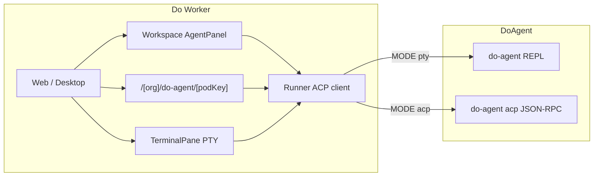

# DoAgent × Do Worker 集成档案

> 状态：**P0–P2 已完成**（双模式对接 + ACP transport + Goal 控制台 + Token 解析）  
> 上游仓库：[AgentForge/doagent](https://github.com/aiedulab/doagent)  
> 迁移：`backend/migrations/000159_add_doagent_agent.up.sql`

## 1. 定位

| 项目 | 角色 |
|------|------|
| **DoAgent** | Rust 通用 coding agent：REPL / query / Goal / ACP stdio / skills / 多 provider |
| **Do Worker** | 多租户平台：Pod 生命周期、终端流、MCP 注入、Autopilot、Web/Desktop 客户端 |

本集成让 Runner 安装 `do-agent` 后，用户可在 **New Pod** 选择 DoAgent，以 **PTY（CLI）** 或 **ACP（对话）** 模式运行。

## 2. 双模式架构



| 模式 | Do Worker UI | do-agent 进程 |
|------|---------------|---------------|
| **CLI / PTY** | Workspace 终端面板 | `do-agent`（TTY → 交互 REPL） |
| **对话 / ACP** | AgentPanel 或 DoAgent 控制台 | `do-agent acp`（JSON-RPC stdio） |

### ACP 协议适配（Runner）

do-agent 与标准 ACP 有几处差异，Runner 通过专属 transport（`runner/internal/agents/doagent/`）桥接：

| 差异 | 适配 |
|------|------|
| `session/new` 要求客户端提供 `sessionId` | Transport 生成 UUID 并写入 params |
| 权限通知为 `permission.updated` + `permission/reply` | 映射到 Do Worker `OnPermissionRequest` / `RespondToPermission` |
| 控制面为原生 RPC（`session/setModel`、`goal/*`） | `SendControlRequest` 映射；UI 可用 `doagent.rpc` 透传任意方法 |
| 无 `session/control_request` 扩展 | 不依赖 agentsmeshExtensions |

## 3. 已交付清单

### Backend

- `000159_add_doagent_agent.up.sql` — builtin agent + AgentFile
- `DO_AGENT_HOME` / `DO_AGENT_SETTINGS` / `DO_AGENT_LOG_DIR` 沙箱隔离
- MCP → `{work_dir}/.agent/config.json`

### Runner

| 文件 | 说明 |
|------|------|
| `doagent/register.go` | ACP transport 注册 + AgentHome + token parser |
| `doagent/transport*.go` | sessionId、权限、control 映射 |
| `doagent/parser.go` | JSONL `llm_response` token 用量 |

AgentHome：`~/.agent` → `{sandbox}/do-agent-home`（settings.json 等）。

### Frontend

| 文件 | 说明 |
|------|------|
| `credentialForms/do-agent.ts` | OpenAI / Anthropic 凭证 |
| `app/(dashboard)/[org]/do-agent/[podKey]/page.tsx` | DoAgent 对话控制台（Goal 栏 + ACP 流） |
| `components/doagent/*` | RPC 控制、Goal 同步 |
| `stores/doagentConsole.ts` | Goal / controlResponse 状态 |

**对话控制台路由**：`/{org}/do-agent/{podKey}` — 适用于 ACP 模式 Pod；含 Goal 暂停/继续、ACP 活动流、权限对话框。

**Workspace AgentPanel**：ACP 模式 Pod 在分屏中同样可用（共享同一 relay 会话）。

## 4. 验证步骤

### 安装 do-agent（Runner 宿主机）

```bash
cd /path/to/AgentForge/doagent && cargo build --release
cp target/release/do-agent ~/.local/bin/
do-agent --version
```

### Do Worker

1. `bazel run //deploy/dev:up`（或现有 dev 环境）
2. Settings → AI Resources：添加 DoAgent 所需的 provider connection 与 model resource
3. **New Pod → DoAgent**：
   - **PTY**：终端出现 REPL（`do-agent` 交互 CLI）
   - **ACP**：Workspace AgentPanel 可对话；或打开 `/{org}/do-agent/{podKey}` 使用 Goal 控制台
4. MCP：创建 Pod 时启用 MCP，检查 `.agent/config.json`

### 自动化测试

```bash
go test ./runner/internal/agents/doagent/... -count=1
go test ./backend/migrations/ -run TestMigration000159 -count=1
bazel test //clients/web:unit --test_filter=doagent
```

## 5. RPC 控制（高级）

前端通过 relay `control_request` 调用 do-agent 原生 RPC：

```typescript
import { doagentRpc, doagentControl } from "@/components/doagent/doagentControl";

doagentRpc(podKey, "goal/list", {});
doagentControl(podKey, "goal/pause", { goalId: "..." });
relayPool.sendAcpCommand(podKey, { type: "set_model", model: "sonnet" });
```

Runner 将 `set_model` → `session/setModel`，`doagent.rpc` → 任意 JSON-RPC 方法。

## 多 Agent 能力

do-agent 的内置 AgentFile 声明 `SKILLS am-delegate, am-channel` 和
`CAPABILITY subagents true`。前端可把它作为多 Agent Worker 创建入口。

## 6. 已知限制

1. **运行时 permission mode**：do-agent 在 `session/new` 设置权限模式；Do Worker `set_permission_mode` 对该 agent 暂不支持（transport 返回 `ErrControlNotSupported`）
2. **Goal UI**：控制台提供列表/暂停/继续；完整 Goal 创建流程仍可在 REPL 或 ACP prompt 中使用 `/goal`
3. **auto-harness 桥接**：已实现 → 见 [`auto-harness.md`](./auto-harness.md)（coordinator 定时扫描 CNB/Linear → ticket → 派发 do-agent pod → 回写评论）

## 7. 文件索引

```
backend/migrations/000159_add_doagent_agent.{up,down}.sql
do-agent capability changes are managed through DoSQL-controlled updates
runner/internal/agents/doagent/
clients/web/src/app/(dashboard)/[org]/do-agent/[podKey]/page.tsx
clients/web/src/components/doagent/
clients/web/src/stores/doagentConsole.ts
docs/integrations/do-agent.md
```

---

*最后更新：2026-06-20 · 集成阶段 P2（双模式对接完成）*
