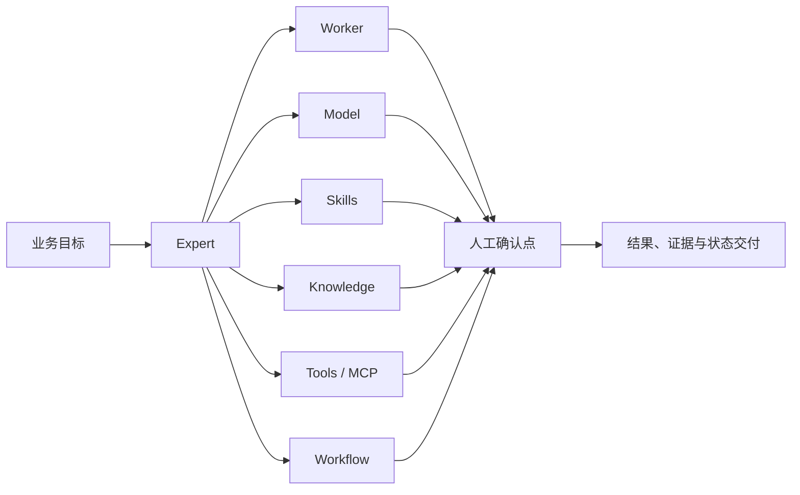

# Do Worker Expert 平台能力地图

- 状态：持续维护
- 基线日期：2026-07-13
- 适用范围：首页、产品规划、专家市场与业务解决方案
- 事实原则：能力必须标记为已落地、可组合或规划中

## 产品定位

Do Worker 是以 Expert 为业务入口的 AI 工作平台。用户描述一个目标，Expert 在
后台选择并协调 Worker、模型、Skills、知识、工具与 Workflow，经过人工确认后
交付可查验结果。底层可以由一个或多个 Worker 执行，但用户不需要管理一组割裂
的聊天角色。



产品公式：

```text
Expert = Worker + Model + Skills + Knowledge + Tools + Workflow
```

资源原生实现中，Expert 不复制这些配置。Expert revision 固定一个
WorkerTemplate revision 和可选 Prompt revision；WorkerTemplate 再固定
ModelBinding、ToolBinding、Repository、Skill、KnowledgeBase、
EnvironmentBundle、ComputeTarget 和 ResourceProfile。Plan 记录每个引用的
revision 与 digest，Apply 后生成 Expert 领域投影和 WorkerSpec 快照。

## 核心对象

| 对象 | 用户理解 | 产品职责 |
| --- | --- | --- |
| Expert | 对结果负责的业务专家 | 固化执行引擎、能力、知识、工具、权限与流程 |
| Worker | Expert 的执行实例 | 在隔离环境中运行具体 Agent 类型 |
| Skill | 可复用的专业方法 | 定义操作步骤、工具约束和交付标准 |
| Knowledge | 组织上下文 | 挂载文件、标准和参考资料 |
| Tool / MCP | 外部动作能力 | 连接浏览器、数据库、媒体工具和业务系统 |
| Workflow | 可重复执行链路 | 定义触发、顺序、并发、检查点、预算和证据 |
| Market | 能力分发入口 | 发现、安装和复用经过验证的专家应用 |

## 能力成熟度

### 已落地

- 12 种正式 Worker 类型的统一目录与运行配置。
- Expert 创建、运行、发布、复用及 Skill、知识和环境装配。
- 自托管 Runner、隔离工作区、模型绑定、凭证引用和运行状态。
- Workflow 手动、API、Cron 触发及并发、超时、沙箱和会话策略。
- 人工暂停、恢复、接管、审批等待、预算与停止条件。
- Ticket、Channel、Mesh、Block Store、文件与媒体结果承载。
- 软件交付、多 Worker 协作、双仓同步三个市场专家应用。

### 可组合

以下能力依赖相应 Skills、模型、MCP 或外部工具，平台负责装配、运行、治理和
交付，不能表述为全部原生内置：

- 研究分析、文档处理、表格、演示文稿与办公流程。
- 内容研究、写作、编辑、本地化与发布。
- 编剧、编导、脚本、分镜与制作交接。
- 图片、音频、视频的生成、编辑、处理与质量检查。
- 数据查询、转换、分析和业务运营流程。
- 课程研究、大纲、课件、实验、练习与评价。

### 规划中

- 更完整的多租户行业专家市场。
- 面向业务系统的 Connector 与资源 Listing。
- 跨境电商、AI 教育、AI 伙伴的可安装专家应用包。
- Space 专区、Entitlement、Quota Ledger 与两阶段安装。

## Worker 目录

当前正式目录包含：

`Aider`、`Claude Code`、`Codex CLI`、`Cursor CLI`、`Do Agent`、
`Gemini CLI`、`Grok Build`、`Hermes`、`Loopal`、`MiniMax CLI`、
`OpenClaw`、`OpenCode`。

Worker 是执行运行时，不直接等同于“教师”“编剧”“运营”等业务角色。业务角色
由 Expert 的完整装配形成。

## 四个业务入口

### 跨境电商

链路：市场调研 → 定位 → 商品与营销内容 → 本地化 → 人工确认 → 发布 → 复盘。

交付：市场简报、Listing、图片或视频素材任务包、本地化内容、过程证据和日报。
店铺、ERP、广告平台写入只能在真实连接和权限存在时启用。

### AI 教育

链路：培养目标 → 课程架构 → 课件 → 实验 → 练习评价 → 教师审核 → 发布更新。

交付：大纲、课件、文档、实验、题库、多媒体资源和验收证据。大纲、事实准确性、
评价标准和正式发布必须保留人工确认。

### AI 伙伴

AI 伙伴是围绕持续业务目标与团队协作的 Expert。它共享组织上下文、组合多种
专业能力，并在关键节点主动同步、请求确认和交付证据；不以模拟单一岗位或替代
人力为产品承诺。

链路：共同设定目标 → 读取组织知识 → 跨工具执行 → 主动同步进展 → 人工确认 →
写回系统 → 结果与证据交付。

首批方向：研究助理、内容运营、文档办公、数据分析、研发交付和运维巡检。

### 市场

当前真实应用：

- `software-delivery-expert`
- `multi-worker-orchestrator`
- `dual-repo-sync-expert`

市场以业务结果为发现入口，详情应先展示结果、所需权限、验证状态和交付示例，
再展示底层 Worker、Skills、知识、工具与 Workflow。

## 首页内容合同

首页必须按以下顺序建立理解：

1. 一个 Expert 入口，而不是多个角色头像。
2. 可操作的运行控制面，展示目标、装配、步骤、人工确认和交付物。
3. 跨境电商、AI 教育、AI 伙伴、市场四个菜单。
4. 能力谱系，并明确已落地、可组合、规划中。
5. Expert 装配公式与可复用运行方式。
6. 当前真实市场应用与后续业务应用方向。
7. 自托管、隔离、限定凭证、证据留痕和 12 种 Worker。
8. 创建专家与查看文档，不在首页展示定价。

当前实现：

- 页面组合：`clients/web/src/components/landing/expert-home/ExpertHome.tsx`
- 内容事实：`expert-home-content.ts`
- 多语言内容：`clients/web/src/messages/*/expert-home.json`
- 首页入口：`clients/web/src/app/page.tsx`

## 事实来源

| 事实 | 来源 |
| --- | --- |
| Worker 类型 | `config/worker-types/catalog.json` |
| Expert 领域模型 | `backend/internal/domain/expert/expert.go` |
| Skill 领域模型 | `backend/internal/domain/skill/skill.go` |
| Workflow | `backend/internal/domain/workflow/workflow.go` |
| Goal Loop | `backend/internal/domain/goalloop/goal_loop.go` |
| Autopilot | `backend/internal/domain/agentpod/autopilot_controller.go` |
| 当前市场应用 | `backend/internal/service/expert/marketplace.go` |
| 媒体与文档承载 | `backend/internal/domain/blockstore/type_bootstrap*.go` |

## 持续维护

发生以下变化时必须更新本文档与首页内容数据：

- Worker 目录新增、删除或更名。
- Expert、Skill、Knowledge、MCP 或 Workflow 装配合同变化。
- 市场应用上线、下线或成熟度变化。
- 新业务场景具备可验证的 Skills、连接、检查点和交付物。
- 自托管、权限、凭证、审计或数据边界变化。

每次更新必须回答：需要什么 Worker、模型、Skills、知识、工具、Workflow、人工
检查点和交付物；并重新确认能力成熟度。禁止用“全自动”“支持所有系统”或
“原生完成所有媒体生产”等无法由代码和验证证据支撑的表述。

## 修订记录

- 2026-07-15：将旧概念升级为 AI 伙伴，强调共享上下文、跨部门协作与人工确认。
- 2026-07-15：补充 Expert 的 resource-native 引用与不可变快照合同。
- 2026-07-13：建立 Expert 产品模型、能力分层、四个业务入口与首页实现基线。
