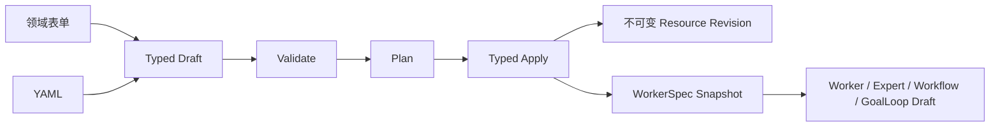

# 资源原生编排指南

## 为什么要使用资源声明

复杂 Agent 的模型、Prompt、工具、知识、仓库和运行配置常分散在多个页面。
资源原生编排把这些对象变成可校验、可引用、可审查、可版本化的声明，再通过
`Validate -> Plan -> Apply` 生成运行快照或领域对象。

它借鉴 Kubernetes 的资源信封和引用方式，但不实现持续调谐。删除 Pod 或终止
Worker 后，平台不会根据 YAML 自动重建；运行、暂停、发布和终止仍是显式操作。



## 资源信封

所有资源使用同一个顶层结构，不同 Kind 拥有不同 `spec`：

```yaml
apiVersion: agentsmesh.io/v1alpha1
kind: Prompt
metadata:
  name: delivery-review
  namespace: acme
  displayName: 交付审查 Prompt
  labels:
    team: engineering
spec:
  content: Review {{topic}} and return a delivery plan.
  variables:
    topic:
      required: true
```

`metadata.name` 和 `namespace` 是 identifier，只允许小写字母、数字和连字符，
长度为 2 到 100，并受保留字约束。`displayName` 仅用于展示，可以使用 Unicode。

## ResourceRef

资源之间只通过 `ResourceRef` 连接，不在上层资源中复制下层配置：

```yaml
workerTemplateRef:
  kind: WorkerTemplate
  name: codex-reviewer
  revision: 3
```

同组织引用可以省略 `namespace`。省略 `revision` 表示 Plan 时读取当前 active
revision，而不是让运行时永久跟随最新版。Plan 会固定：

```text
apiVersion + kind + namespace + name + uid + revision + digest
```

Apply 和后续运行使用固定结果，不再按名称重新解析。修改 ModelBinding、Prompt
或 WorkerTemplate 不会改变历史 Expert、Workflow 或 Worker 的执行快照。

## 当前支持矩阵

| Kind | Validate / Plan | Typed Apply | 结果 |
| --- | --- | --- | --- |
| `ModelBinding` 等绑定资源 | 是 | 是 | 不可变绑定 revision |
| `Prompt` | 是 | 是 | 不可变 Prompt revision |
| `WorkerTemplate` | 是 | 是 | revision + WorkerSpec 快照 |
| `Worker` | 是 | 是 | 一次性资源、launch 记录和 Pod |
| `Expert` | 是 | 是 | Expert 投影 + 固定 WorkerSpec 快照 |
| `Workflow` | 是 | 是 | Workflow 投影 + 固定 WorkerSpec 快照 |
| `GoalLoop` | 是 | 是 | GoalLoop 草稿 + 固定 WorkerSpec 快照 |

绑定资源包括 `ModelBinding`、`ToolBinding`、`Repository`、`Skill`、
`KnowledgeBase`、`EnvironmentBundle`、`ComputeTarget` 和
`ResourceProfile`。完整字段见[资源 Kind 声明参考](resource-kind-reference.md)。

## Worker、Expert 与 Workflow 的区别

- `WorkerTemplate` 声明可复用运行配置，包括 Worker 类型、模型、工具、镜像、
  计算目标、资源限制、工作区和生命周期。
- `Worker` 引用一个 WorkerTemplate，可附加 Prompt、输入和别名。它是一次性
  启动声明，创建后不能通过同一资源更新。
- `Expert` 引用 WorkerTemplate 和可选 Prompt，额外声明分类、说明和发布说明。
- `Workflow` 引用 WorkerTemplate 和必填 Prompt，额外声明执行、Cron、沙箱、
  会话、并发、保留、超时与回调策略。
- `GoalLoop` 引用 WorkerTemplate，声明目标、验收标准、验证命令和停止预算；
  Apply 创建固定 revision 和 WorkerSpec 快照的草稿，不会自动启动。

## 用户界面

- `/{org}/workers/new`：立即运行 Worker、保存 WorkerTemplate、管理引用资源。
- `/{org}/experts/new`：创建 Expert 资源。
- `/{org}/workflows`：在“创建 Workflow”中使用资源编辑器。
- `/{org}/loops`：在“新建 Loop”中 Apply GoalLoop 草稿，再从列表显式启动。

领域表单与 YAML 操作同一个 typed draft。修改任一视图都会使旧 Plan 失效。
YAML 解析失败时保留原文，并禁用表单切换、Plan 和 Apply；系统不会使用上一个
有效草稿静默继续。GoalLoop 数字字段会保留无效原文并显示字段错误，空值、小数
或超出 JavaScript 安全整数范围的值不会被静默改成其他数字。

## Validate、Plan 与 Apply

1. Validate 检查 YAML/JSON、schema、identifier、字段语义、权限和引用。
2. Plan 生成 canonical manifest、语义 Diff、固定引用和目标编译产物。
3. 用户审查 CREATE/UPDATE、阻塞问题、warning、revision 和 digest。
4. Typed Apply 重新检查身份、组织权限、Plan 状态和引用可读性。
5. Apply 原子消费 Plan；当前服务端 Plan 有效期为 15 分钟且只能消费一次。

更新资源时，如果 head 的 `resourceVersion` 已变化，旧 Plan 会明确报 stale。
同名创建已被其他请求完成时也会失败，不会覆盖已有资源。
Worker 和 GoalLoop 都是 create-only；已有同名资源或历史 GoalLoop 会在 Plan
阶段产生 blocking issue，而不是生成一份注定无法 Apply 的计划。

GoalLoop Apply 只创建 `draft` 领域对象、不可变 resource revision 和固定
WorkerSpec 快照。它不会创建 Pod，也不会进入 active 状态；启动、验证和取消仍
通过 GoalLoop 的显式领域操作完成。

## Agent 通过 MCP 创建 Worker 与 Workflow

Runner 的 `create_pod` 和 `create_workflow` MCP 工具也使用同一资源声明，不再
接受 `agent_slug`、`runner_id`、Prompt 文本或其他运行时拼装字段。工具参数中的
`resource` 是 JSON 形式的 `Worker` 或 `Workflow` 清单：

```json
{
  "resource": {
    "apiVersion": "agentsmesh.io/v1alpha1",
    "kind": "Worker",
    "metadata": {
      "name": "review-worker",
      "namespace": "acme"
    },
    "spec": {
      "workerTemplateRef": {
        "kind": "WorkerTemplate",
        "name": "codex-reviewer"
      },
      "inputs": {},
      "alias": "review-worker"
    }
  }
}
```

Backend 会在一次工具调用中执行 Validate、Plan、调用方 Apply 权限复核和 typed
Apply。响应包含领域对象，以及实际应用的 resource revision 和
`worker_spec_snapshot_id`。引用资源必须先 Apply；MCP 不会创建缺失依赖，也
不会绕过 stale Plan、权限、Secret 或 Worker 创建选项目录检查。

`create_workflow` 使用相同的 `resource` 参数，Kind 必须是 `Workflow`；可额外
传 `enabled: true`。省略时新 Workflow 保持 disabled，避免声明后立即调度。

## Secret 与权限

YAML 不能包含 API key、Token 或密码。ModelBinding 只保存模型资源 ID，凭据仍
由 AI 资源连接加密管理；WorkerTemplate 的 Secret 通过
`EnvironmentBundle` 引用：

```yaml
typeConfig:
  secretRefs:
    api-token:
      kind: EnvironmentBundle
      name: production-secrets
```

Plan、Diff、导出和错误只显示资源身份与 digest，不回显 Secret。namespace
不能替代权限校验；跨组织引用、无权读取、依赖已撤销或 Apply 时权限变化都会
明确失败。

## 继续阅读

- [资源 YAML 用户手册](resource-yaml-manual.md)
- [资源 Kind 声明参考](resource-kind-reference.md)
- [基础引用资源声明](resource-build-blocks-reference.md)
- [执行资源声明](resource-execution-reference.md)
- [资源原生迁移说明](resource-native-migration.md)
- [资源编排 API](../api/orchestration-resources.md)
