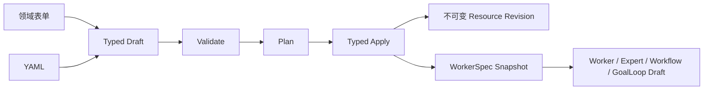

# 资源原生编排指南

## 为什么要使用资源声明

复杂 Agent 的模型、Prompt、工具、知识、仓库和运行配置常分散在多个页面。
资源原生编排把这些对象变成可校验、可引用、可审查、可版本化的声明，再通过
`Validate -> Plan -> Apply` 生成运行快照或领域对象。

它借鉴 Kubernetes 的资源信封和引用方式，但不实现持续调谐。删除 Pod 或终止
Worker 后，平台不会根据 YAML 自动重建；运行、暂停、发布和终止仍是显式操作。



## 资源信封

所有资源使用同一个顶层结构，不同 Kind 拥有不同 `spec`：

```yaml
apiVersion: agentsmesh.io/v1alpha1
kind: Prompt
metadata:
  name: delivery-review
  namespace: acme
  displayName: 交付审查 Prompt
  labels:
    team: engineering
spec:
  content: Review {{topic}} and return a delivery plan.
  variables:
    topic:
      required: true
```

`metadata.name` 和 `namespace` 是 identifier，只允许小写字母、数字和连字符，
长度为 2 到 100，并受保留字约束。`displayName` 仅用于展示，可以使用 Unicode。

## ResourceRef

资源之间只通过 `ResourceRef` 连接，不在上层资源中复制下层配置：

```yaml
workerTemplateRef:
  kind: WorkerTemplate
  name: codex-reviewer
  revision: 3
```

同组织引用可以省略 `namespace`。省略 `revision` 表示 Plan 时读取当前 active
revision，而不是让运行时永久跟随最新版。Plan 会固定：

```text
apiVersion + kind + namespace + name + uid + revision + digest
```

Apply 和后续运行使用固定结果，不再按名称重新解析。修改 ModelBinding、Prompt
或 WorkerTemplate 不会改变已经固定的上层 ResourceRef 与 WorkerSpec 身份。

当前交付边界需要区分“引用已固定”和“底层运行事实已物化”。资源 revision
已经固定引用的 UID、revision 与 digest，但 Pod 启动仍会从当前领域表读取部分
模型 endpoint、模型 ID、仓库、Skill、KnowledgeBase 和 EnvironmentBundle
事实。AI 连接验证状态、展示名、启停和凭据轮换不会推进运行配置 revision；
BaseURL、模型 ID、模态或能力变化会推进 revision，使旧快照明确失败，而不是
静默使用最新版。完整历史可重放仍以“解析依赖快照”迁移和运行时切换完成为
交付门禁。

## 当前支持矩阵

| Kind | Validate / Plan | Typed Apply | 结果 |
| --- | --- | --- | --- |
| `ModelBinding` 等绑定资源 | 是 | 是 | 不可变绑定 revision |
| `Prompt` | 是 | 是 | 不可变 Prompt revision |
| `WorkerTemplate` | 是 | 是 | revision + WorkerSpec 快照 |
| `Worker` | 是 | 是 | 一次性资源、launch 记录和 Pod |
| `Expert` | 是 | 是 | Expert 投影 + 固定 WorkerSpec 快照 |
| `Workflow` | 是 | 是 | Workflow 投影 + 固定 WorkerSpec 快照 |
| `GoalLoop` | 是 | 是 | GoalLoop 草稿 + 固定 WorkerSpec 快照 |

绑定资源包括 `ModelBinding`、`ToolBinding`、`Repository`、`Skill`、
`KnowledgeBase`、`EnvironmentBundle`、`ComputeTarget` 和
`ResourceProfile`。完整字段见[资源 Kind 声明参考](resource-kind-reference.md)。
表中的“不可变”指资源层 revision 与 WorkerSpec 身份；底层依赖的历史运行事实
在解析依赖快照交付前不应被视为已经完整物化。

## Worker、Expert 与 Workflow 的区别

- `WorkerTemplate` 声明可复用运行配置，包括 Worker 类型、模型、工具、镜像、
  计算目标、资源限制、工作区和生命周期。Worker Definition 同时声明所需模型
  协议、credential 和配置文档；配置文档通过
  `configDocumentBindings[].documentId + configBundleRef` 精确绑定。
- `Worker` 引用一个 WorkerTemplate，可附加 Prompt、输入和别名。它是一次性
  启动声明，创建后不能通过同一资源更新。
- `Expert` 引用 WorkerTemplate 和可选 Prompt，额外声明分类、说明和发布说明。
- `Workflow` 引用 WorkerTemplate 和必填 Prompt，额外声明执行、Cron、沙箱、
  会话、并发、保留、超时与回调策略。
- `GoalLoop` 引用 WorkerTemplate，声明目标、验收标准、验证命令和停止预算；
  Apply 创建固定 revision 和 WorkerSpec 快照的草稿，不会自动启动。

## 用户界面

- `/{org}/workers/new`：立即运行 Worker、保存 WorkerTemplate、管理引用资源。
- `/{org}/experts/new`：创建 Expert 资源。
- `/{org}/workflows`：创建时使用资源编辑器；详情页“新建修订”先导出 active
  Workflow 声明，再把同一个 typed draft 交给领域表单和 YAML 高级视图。
- `/{org}/loops`：在“新建 Loop”中 Apply GoalLoop 草稿，再从列表显式启动。

领域表单与 YAML 操作同一个 typed draft。修改任一视图都会使旧 Plan 失效。
YAML 解析失败时保留原文，并禁用表单切换、Plan 和 Apply；系统不会使用上一个
有效草稿静默继续。表单引用只能从当前组织的授权目录选择；目录加载、权限错误、
无候选或已有引用无法解析时保留原值并只读。GoalLoop 数字字段会保留无效原文，
空值、小数或超出 JavaScript 安全整数范围的值不会被静默改成其他数字。

## 声明与动作边界

Expert、Workflow 和 GoalLoop 的定义必须通过资源编辑器或资源 Connect API
执行 `Validate -> Plan -> typed Apply`。旧 `CreateWorkflow`、
`CreateGoalLoop`、`RunLoopProgram` 和 Runner MCP `create_workflow` 会返回
前置条件错误，不再根据 Agent、Runner、仓库、Program 或 Prompt 字段直接创建
定义。

资源托管的 Expert 和 Workflow 不能通过旧 Update/Delete 接口改变投影。
修改声明时应编辑 YAML 或领域表单并 Apply 新 revision。以下操作仍是显式领域
动作，不需要把运行状态写回 YAML：

- Workflow：Enable、Disable、Trigger、Cancel run；
- GoalLoop：Start、Verify、Cancel；
- Expert：Run，可为单次调用提供 prompt override。

Workflow 触发时会把 resource revision、WorkerSpec snapshot、触发参数和解析后
Prompt 一起固定到 run，并保存执行模式、Autopilot、沙箱、会话来源、回调、
Ticket、保留和 timeout/idle 配置。后续启动、完成处理和超时扫描只读取 run
中的固定值，不会重新读取可变 Workflow 定义，也不会生成 AgentFile 旧运行配置。
首次或 fresh 运行从固定 snapshot 启动；persistent 运行存在前序 Pod 时只沿
source lineage 恢复。当前 run 的 Prompt 是调用元数据，不会与 lineage 同时
提交第二个 snapshot 来源，也不会改变固定的 WorkerSpec。

## Validate、Plan 与 Apply

1. Validate 检查 YAML/JSON、schema、identifier、字段语义、权限和引用。
2. Plan 生成 canonical manifest、语义 Diff、固定引用和目标编译产物。
3. 用户审查 CREATE/UPDATE、阻塞问题、warning、revision 和 digest。
4. Typed Apply 重新检查身份、组织权限、Plan 状态和引用可读性。
5. Apply 原子消费 Plan；当前服务端 Plan 有效期为 15 分钟且只能消费一次。

“校验”按钮用于提前查看问题；“生成计划”也会先执行同一套服务端校验，因此
直接生成 Plan 不会绕过 schema、identifier、权限或引用检查。资源编辑器在
Apply 成功、冲突或响应不确定后都会退役当前 Plan，必须重新生成并审查 Plan
才能再次 Apply。

更新资源时，如果 head 的 `resourceVersion` 已变化，旧 Plan 会明确报 stale。
同名创建已被其他请求完成时也会失败，不会覆盖已有资源。
Worker 和 GoalLoop 都是 create-only；已有同名资源或历史 GoalLoop 会在 Plan
阶段产生 blocking issue，而不是生成一份注定无法 Apply 的计划。

GoalLoop Apply 只创建 `draft` 领域对象、不可变 resource revision 和固定
WorkerSpec 快照。它不会创建 Pod，也不会进入 active 状态；启动、验证和取消仍
通过 GoalLoop 的显式领域操作完成。

## Secret 与权限

YAML 不能包含 API key、Token 或密码。ModelBinding 只保存模型资源 ID，凭据仍
由 AI 资源连接加密管理；WorkerTemplate 的 Secret 通过
`EnvironmentBundle` 引用：

```yaml
typeConfig:
  secretRefs:
    CURSOR_API_KEY:
      kind: EnvironmentBundle
      name: cursor-credentials
```

Worker Definition 要求的配置文档同样只保存引用：

```yaml
workspace:
  configDocumentBindings:
    - documentId: settings
      configBundleRef:
        kind: EnvironmentBundle
        name: do-agent-settings
```

领域表单根据当前 Worker 类型目录生成 credential 和配置文档字段。切换类型时
只保留仍被新类型声明的同名引用，并删除失效项；系统不会把匿名配置包或未知
Secret key 静默映射到新的 Worker Definition。EnvironmentBundle 候选同时按
当前 actor 的用户/组织 ownership、active 状态、Worker `agentSlug` 与用途
过滤：runtime 字段接受 `runtime/shared`，配置文档接受 `config`，Secret
引用接受 `credential`。服务端还会从 Worker Definition 派生字段策略：
runtime 候选排除包含模型资源托管字段的包，每个 Secret 字段只显示包含对应
`target_name` 的包。前端不复制字段清单，也不读取 Secret 值。控制面必须在
响应中确认已应用用途、Worker 类型和目标字段；旧服务端忽略请求字段、响应确认
不一致或底层资源绑定损坏时，字段显示明确错误，不展示未过滤候选。YAML 仍可
手工声明；WorkerTemplate 生成 Plan 前会重新加载当前组织的 Worker 选项与引用
目录，先拒绝失效类型、runtime、`optionsRevision` 或引用，再调用服务端 Plan。

Plan、Diff、导出和错误只显示资源身份与 digest，不回显 Secret。namespace
不能替代权限校验；跨组织引用、无权读取、依赖已撤销或 Apply 时权限变化都会
明确失败。

凭据轮换更新当前 Secret 引用，不创建包含明文或密文的历史快照。轮换不会改变
AI 运行配置 revision，且轮换前启动的验证结果不能覆盖轮换后的状态。底层依赖
历史物化完成前，不要删除仍被已发布 WorkerSpec 使用的连接或依赖资源；运行时
遇到缺失、禁用或 revision 不一致会明确失败，不会退回名称查询或最新版本。

资源选择器按 Kind 独立加载。某一种引用资源无权读取或暂时不可用时，只在对应
字段显示错误，不会清空已经成功加载的其他 Kind；EnvironmentBundle 的三种
用途目录也彼此隔离失败。

Apply 在写事务内再次锁定组织成员关系。成员被移除，或非创建者在等待锁期间从
admin 降为 member，都会使 Apply 失败；已消费 Plan 的重放也不会绕过这次检查。
资源修订对话框会先查询 `GetResourceCapabilities`；无 source/Plan 权限时不会
导出声明或创建可编辑 Draft。Capabilities 只改善前端反馈，服务端仍逐次授权。

## 继续阅读

- [资源 YAML 用户手册](resource-yaml-manual.md)
- [资源 Kind 声明参考](resource-kind-reference.md)
- [基础引用资源声明](resource-build-blocks-reference.md)
- [执行资源声明](resource-execution-reference.md)
- [资源原生迁移说明](resource-native-migration.md)
- [资源编排 API](../api/orchestration-resources.md)
