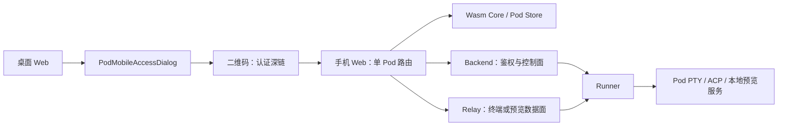
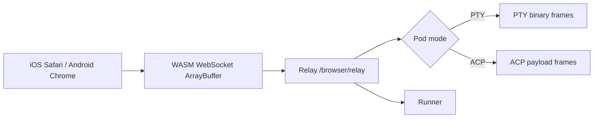

# AgentsMesh 移动端接入 Plan B
**状态：** 详细设计
**日期：** 2026-07-10
**本轮范围：** Plan B V1 自有移动入口实现、测试与提交前 blocker 修复。
## 1. 结论
采用 Plan B：复用 AgentsMesh 的 Pod、Relay、Runner、Wasm Core 与现有 Web
工作台，只补齐“移动端入口层”。不引入 lulu 的 `pc-gateway`、`cloud-relay`
或 `codexapp`。

移动端不是第二套 Agent 运行时，也不是第二套终端协议。手机与桌面访问同一个
Pod；浏览器终端仍经由既有 Relay，预览仍经由既有 Runner tunnel。

V1 的授权模型是“已登录且具备该 Pod `read` 权限的组织成员”。二维码只携带
深链，不携带 JWT、Relay token、预览 token 或可匿名访问的签名。

## 2. 对标项目结论

`lulu-codex-web-mac` 的可借鉴点是产品入口：

- PC 页面生成二维码，手机扫码后进入单 Pod 工作区。
- 本地、远程和预览入口明确分离。
- 预览请求支持 HTTP 与 WebSocket。

它不应被移植的部分：

- `pc-gateway` 负责启动外部 `codexapp`、二维码门户、云反连和预览控制。
- `cloud-relay` 自建反向代理和会话通道。
- `codexapp` 是独立工作台，不认识 AgentsMesh 的 Org、Pod、Runner 与 RBAC。

AgentsMesh 已具备上述底座能力。直接引入 lulu 会形成双运行时、双 Relay、
双预览代理和双工作台，成本与故障面都不可接受。

## 3. 现有可复用能力

| 能力 | 现有实现 | Plan B 动作 |
|---|---|---|
| PTY 终端 | `TerminalPane` + `useTerminal` + RelayConnectionPool | 直接复用 |
| ACP 会话 | `AgentPanel` 内 ACP hooks 与子组件 | 抽取移动端布局，复用状态与 relay |
| 手机终端切换 | `TerminalSwiper` + `TerminalToolbar` | 作为交互参考，不复制协议 |
| Pod 读取 | `usePodStore.fetchPod` 写入 Rust Core 缓存 | 独立页面先加载指定 Pod |
| 预览 token | `GetPodPreview` | 直接调用 |
| 预览代理 | Relay `/preview/{podKey}/...` | 直接使用 |
| Runner tunnel | `/runner/tunnel` + tunnel registry | 不修改 |

关键源码：

- [终端移动布局](/Users/wwyz/Documents/code/AgentsMesh/clients/web/src/components/workspace/WorkspaceManager.tsx:68)
- [终端 Pane](/Users/wwyz/Documents/code/AgentsMesh/clients/web/src/components/workspace/TerminalPane.tsx:1)
- [ACP 组合](/Users/wwyz/Documents/code/AgentsMesh/clients/web/src/components/workspace/AgentPanel.tsx:54)
- [Pod 读取写入 Rust Core](/Users/wwyz/Documents/code/AgentsMesh/clients/web/src/stores/pod.ts:96)
- [预览入口](/Users/wwyz/Documents/code/AgentsMesh/backend/internal/api/rest/v1/pod_preview.go:39)
- [预览路由解析](/Users/wwyz/Documents/code/AgentsMesh/backend/internal/service/relay/preview.go:28)

## 4. 目标架构



终端数据面不经过 Backend；Backend 只签发连接信息并向 Runner 下发控制命令。
预览的目标固定为已验证的 `127.0.0.1:{preview_port}`，由 token claim 绑定
Pod、Runner、组织、用户和目标地址。

## 5. V1 功能清单

| 功能 | 用户结果 | 复用边界 |
|---|---|---|
| 手机 Pod 工作区 | 手机打开单个 PTY 或 ACP Pod | 复用 `TerminalPane`、ACP relay/state |
| ACP 移动布局 | 计划、活动、授权、输入框可用 | 不复用桌面拆分/弹窗工具栏 |
| 桌面二维码入口 | 从 Pod 右键菜单生成手机深链 | 新 UI，无新授权模型 |
| 手机预览入口 | 打开 Pod Web 服务 | 复用现有 REST、Relay、tunnel |
| 预览能力展示 | 只对配置 preview 的 Pod 显示预览入口 | Pod proto 投影补充元数据 |

## 6. 重复代码控制

允许新增的 UI 层：

- `MobilePodWorkspace`
- `MobileAcpWorkspace`
- `PodMobileAccessDialog`
- `PodMobileAccessQr`
- 两个路由页

禁止新增：

- 移动端专属 WebSocket 协议或 Relay 客户端
- 第二个预览 HTTP/WS 代理
- 第二个 Runner/gateway 进程
- `codexapp` iframe 或平行工作台
- 公共分享 token、持久化访问链接表

预览能力以 `preview_port > 0` 在前端投影处计算。不要添加一个可过期或不同步的
`preview_enabled` 域字段；现有 `PreviewPort` 是唯一事实来源。

## 7. 移动设备与协议对齐

V1 是响应式 Web，目标为 iOS Safari 与 Android Chrome；不包含原生 iOS/Android
App、原生推送、后台常驻连接或 App 专属协议。

移动端与桌面端共用控制面、数据面、帧格式和鉴权边界：

| 能力 | 统一实现 | 是否新增移动协议 |
|---|---|---|
| Pod 查询 | Connect `GetPod` | 否 |
| 连接信息 | Connect `GetPodConnection` | 否 |
| PTY | Relay Browser WebSocket 二进制帧 | 否 |
| ACP | 同一 Relay WebSocket 的 ACP 帧 | 否 |
| Preview 建立 | REST `GET .../preview` | 否 |
| Preview 内容 | Relay HTTP proxy / WebSocket upgrade | 否 |
| Runner tunnel | `/runner/tunnel` WebSocket | 否 |

浏览器 WASM transport 使用标准 `WebSocket` 和 `ArrayBuffer`：

```rust
ws.set_binary_type(BinaryType::Arraybuffer);
ws.send_with_u8_array(&data)?;
```

来源：[WASM transport](/Users/wwyz/Documents/code/AgentsMesh/clients/core/crates/transport/src/wasm.rs:29)。
PTY 复用既有 `Input`、`Output`、`Snapshot`、`Resize`、`Resync` 帧；ACP 复用
`AcpCommand`、`AcpEvent`、`AcpSnapshot` 帧。手机页面不建立平行 socket，不经
Next.js 或 Backend 转发 terminal 数据。



现有 Relay driver 在 socket close、错误或未收到 snapshot 时按退避策略重连，重连后
发出 `Resync` 并重放最后有效尺寸。[重连](/Users/wwyz/Documents/code/AgentsMesh/clients/core/crates/relay/src/driver/mod.rs:143)
与 [resync/resize](/Users/wwyz/Documents/code/AgentsMesh/clients/core/crates/relay/src/driver/session.rs:56)
均为桌面和移动端共享逻辑。`useTerminalResize` 已在 `visibilitychange` 回到前台时
重新 fit 和发送 resize。

手机后台可能冻结 JS 或关闭 WebSocket。V1 不承诺后台持续交互；回到前台后必须自动
恢复或明确显示重连状态。若真实设备发现恢复失败，修复必须落在共享
RelayConnectionPool/driver 生命周期中，不能在移动页面建立旁路连接。

生产环境必须保证 App/API 使用 HTTPS、Browser Relay 使用 WSS、Preview 反向代理
保留 `Upgrade`/`Connection` 头。二维码只含同源深链，不含 token；Preview 页面经
认证 REST 换取 30 分钟短时 token，再由 Relay `__session` 换为 `HttpOnly`、
`SameSite=Lax`、Pod 路径限定的 cookie 后整页跳转，避免 iOS iframe cookie 限制。

V1 必须在真实 iPhone Safari 和 Android Chrome 验证：扫码登录回跳、PTY 的中文 IME/
触控滚动/旋转 resize、ACP 权限操作、后台 30 秒后前台恢复、Wi-Fi/蜂窝切换、Preview
HTTP/WebSocket 资源以及 console 中不存在 mixed-content、CORS、cookie 或 WS 错误。

## 8. 精确改动范围

新增：
```text
clients/web/src/app/(dashboard)/[org]/mobile/pods/[podKey]/page.tsx
clients/web/src/app/(dashboard)/[org]/mobile/pods/[podKey]/preview/page.tsx
clients/web/src/app/(dashboard)/[org]/mobile/pods/[podKey]/preview/page.test.tsx
clients/web/src/components/mobile/MobilePodWorkspace.tsx
clients/web/src/components/mobile/PodMobileAccessDialog.tsx
clients/web/src/components/mobile/__tests__/MobilePodWorkspace.test.tsx
clients/web/src/components/mobile/__tests__/PodMobileAccessDialog.test.tsx
clients/web/src/lib/api/podPreview.ts
clients/web/src/lib/api/__tests__/podPreview.test.ts
clients/web/src/lib/pod-mobile-access.ts
```

修改：
```text
clients/web/src/lib/ide-chrome.ts
clients/web/src/components/ide/sidebar/SidebarPodContextMenu.tsx
clients/web/src/components/ide/sidebar/PodListItem.tsx
clients/web/src/components/ide/sidebar/WorkspaceSidebarContent.tsx
clients/web/src/components/mobile/index.ts
clients/web/src/messages/en/app.json
clients/web/src/messages/zh/app.json
```

共享协议 commit 统一维护 `preview_port`、`preview_path` 到
`Pod.PreviewPort`、`Pod.PreviewPath` 的投影。移动自有提交不纳入
`proto/pod/v1/pod.proto`、Pod TS 生成物、Pod converter 或 view-model。前端以
`preview_port > 0` 派生显示状态，不增加独立 `preview_enabled` 状态源。

移动入口不新增 Backend API、Relay 路由/协议/token 类型、Runner tunnel 或 Wasm
RelayConnectionPool；schema blocker 由正式 `000195` migration 补齐。不实现匿名链接、
访问码、浏览器自动化 sidecar。

## 9. 边界
V1 只包含移动单 Pod 页面、PTY/ACP 复用、二维码入口、预览元数据和预览跳转页。
浏览器自动化 sidecar、匿名外链和新的 tunnel 协议明确不在本次改动范围内。
