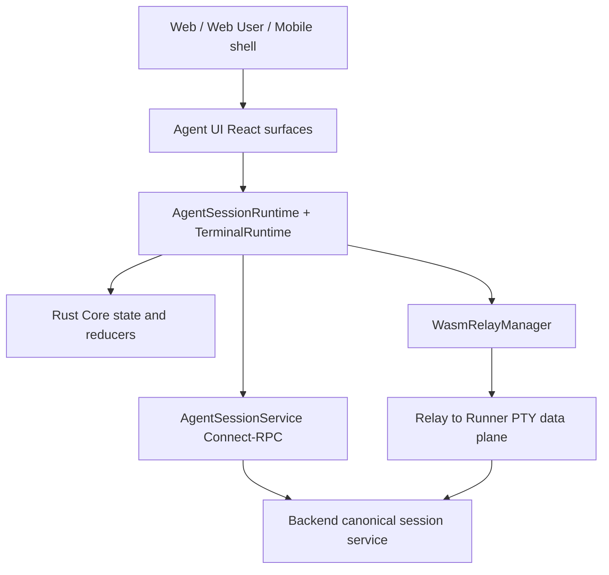

# Agent Conversation Component Design

**Status:** proposed
**Date:** 2026-07-12
**Scope:** unify the Agent conversation and terminal capabilities currently split across `clients/web` and `clients/web-user`.

**Initial delivery:** `packages/agent-ui` now supplies the stable React,
web-island, and iframe boundaries. Its `web-user` adapter is transitional;
the Rust/Connect runtime remains the next state-ownership delivery.

## 1. Decision

Adopt a headless capability runtime plus reusable React surfaces.

The unified implementation has one conversation state machine in Rust Core,
one Connect-RPC command and event protocol, and one Relay terminal data plane.
`clients/web` and `clients/web-user` remain product shells during migration.
They do not own conversation state, parse protocol events, refresh auth tokens,
or issue Agent commands directly.

`web-user` standalone and embedded delivery remain supported assumptions. The
shared runtime must therefore be host-neutral and cannot depend on Next.js,
React Router, browser globals at module initialization, or application-specific
Zustand stores.

## 2. Alternatives

| Approach | Result | Decision |
| --- | --- | --- |
| Share existing React components only | Fast initial reuse, but keeps REST/SSE and Relay/ACP state machines, duplicate commands, and incompatible React assumptions | Reject |
| Merge all `web-user` pages into `web` | One application, but breaks embedded delivery and couples migration to a complete product rewrite | Defer |
| Rust headless runtime + Connect protocol + React surfaces | One state owner, reusable in both shells, supports incremental replacement | Adopt |

## 3. Existing Capability Ownership

### Take from `clients/web`

- Rust/WASM as the authoritative client state owner.
- `WasmRelayManager`: Relay connection pooling, reconnect, resync, codec,
  terminal resize, input deduplication, and control lease.
- Pod lifecycle, organization context, workspace split panes, popout behavior,
  and connection state presentation.
- ACP visual patterns for plan, tool activity, permission prompts, model and
  permission-mode controls.
- `AuthManager` and Connect-RPC transport construction.

The existing `AcpSessionManager` is not the target conversation model. It is
pod-keyed, bounded in-memory activity state without durable item identity,
history pagination, command causation, or reconnect cursor semantics. Its
useful reducers move into the new session runtime.

### Take from `clients/web-user`

- Session as the durable conversation identity and `pod_key` binding.
- Cursor-paginated conversation history and rich item types.
- Optimistic send behavior, attachment upload, interruption, slash commands,
  approvals, model/effort controls, usage, todos, skills, child sessions,
  presence, sandbox state, and terminal resources.
- Rich transcript rendering for messages, reasoning, tool calls, native tools,
  errors, compaction, routing decisions, terminal commands, and files.
- Standalone and embedded host integration.

Do not take the REST authentication client, local session refresh logic,
`chatStore` ownership, SSE parser ownership, or application routing.

## 4. Target Layers



### Rust Core

Add a session domain manager keyed by `session_id`, with a secondary
`pod_key -> session_id` index. It owns snapshot application, ordered event
reduction, optimistic commands, history windows, active turn state, permissions,
resources, configuration, connection health, and errors.

Zustand may expose a `_tick` and cached projections for React, but must not
duplicate or mutate domain state.

### Service Interface

Add `IAgentSessionService` and `ITerminalRuntime` to
`@agent-cloud/service-interface`. Web WASM and future native adapters implement
the same interface. Components receive these interfaces through
`AgentRuntimeProvider`; they never import `wasm-core`, fetch, Relay, or auth
stores directly.

### React Package

Create `packages/agent-ui` with React as a peer dependency. It must support the
React version shared by both hosts before either app imports it. Align
`web-user` to the root React version as a separate prerequisite; do not ship
two React copies.

The package uses existing CSS variables and class-name injection. It contains
no Next.js routing, product navigation, organization switching, or login UI.

## 5. Atomic Capabilities

`AgentSessionRuntime` exposes:

```text
open(session_id)
close(session_id)
create(input)
send_message(session_id, command_id, content)
send_slash_command(session_id, command_id, command)
interrupt(session_id, command_id)
resolve_permission(session_id, command_id, elicitation_id, result)
update_configuration(session_id, command_id, patch)
load_older(session_id, before_item_id)
refresh_snapshot(session_id)
subscribe(session_id, listener)
get_snapshot(session_id)
```

`TerminalRuntime` exposes:

```text
connect(pod_key, subscriber_id)
write(pod_key, bytes)
resize(pod_key, columns, rows)
acquire_control(pod_key, client_label)
renew_control(pod_key, lease_id)
release_control(pod_key, lease_id)
subscribe_output(pod_key, listener)
subscribe_status(pod_key, listener)
disconnect(pod_key, subscriber_id)
```

Commands require caller-generated `command_id`. The runtime never retries a
non-idempotent command under a new ID.

## 6. Components

| Component | Responsibility |
| --- | --- |
| `ConversationSurface` | Timeline, active response, history loading, pending messages, errors, empty/loading states |
| `ConversationComposer` | Text, attachments, slash commands, send/interrupt, disabled and permission states |
| `ActivityTimeline` | Message, reasoning, plan, tool, result, error, usage and system item rendering |
| `PermissionPrompt` | One pending elicitation and explicit response |
| `SessionHeader` | Agent identity, status, presence, branch, usage and host-provided actions |
| `TerminalSurface` | xterm lifecycle, output, input, resize and reconnect display |
| `TerminalControl` | Observer/control lease acquisition, renewal and release |
| `AgentWorkspace` | Chooses and composes conversation, primary terminal, and auxiliary terminals |

`ConversationSurface` and `TerminalSurface` are independent. `AgentWorkspace`
uses `interaction_mode` and advertised resources:

- `acp`: writable conversation; terminals may appear as auxiliary resources.
- `pty`: writable primary terminal; transcript may be read-only when available.

The UI must not offer a cosmetic mode switch that changes a running Pod's
interaction mode.

## 7. State Model

`AgentSessionSnapshot` contains identity, agent binding, interaction mode,
session status, history window, active turn, pending commands, permissions,
configuration, capabilities, usage, resources, presence, child sessions, and
connection state.

Timeline entries use stable server item IDs. Optimistic entries use
`command_id`; acknowledgment replaces their identity with `item_id` without
FIFO matching. Active deltas carry `response_id` and are replaced by the final
durable item when committed.

Derived view models are computed in Rust. Rendering-only state such as an open
popover, scroll anchor, split ratio, and draft text remains in React.

## 8. Auth Boundary

Conversation components never log in or refresh tokens. Each host initializes
the shared `AuthManager`; Connect and Relay token requests read its current
organization-scoped credential.

`web-user` removes its `/auth/login` and independent refresh ownership after
adopting the shared manager. Embedded hosts may inject an already-issued
session through the explicit `apply_session` contract. Browser and host must
not run concurrent refresh loops because refresh tokens rotate.

Protocol details are specified in
`2026-07-12-agent-conversation-protocol-design.md`. Command flow, terminal
behavior, migration, and acceptance are specified in
`2026-07-12-agent-conversation-delivery-design.md`.
