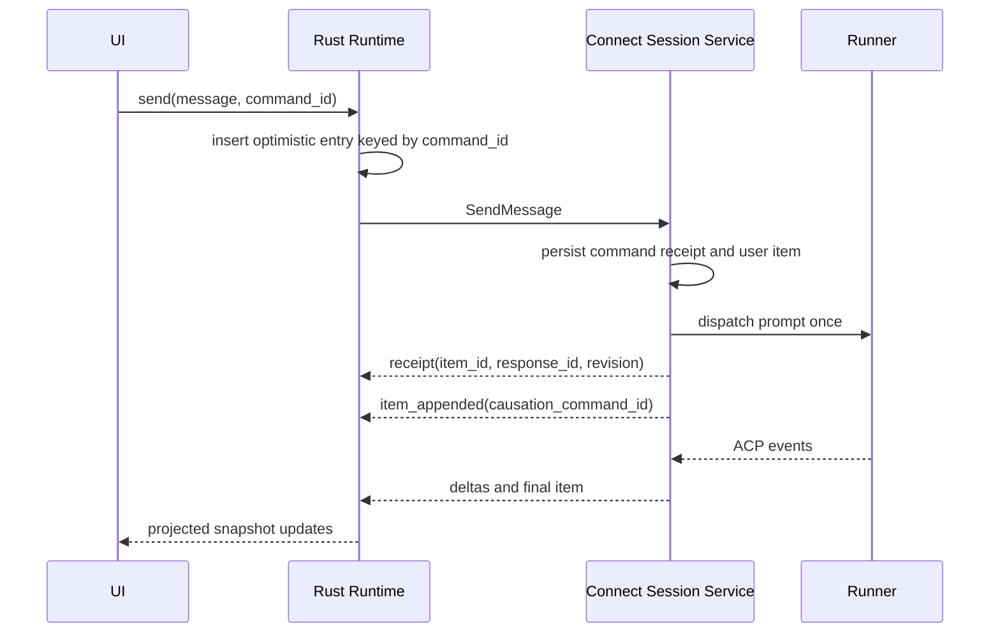

# Agent Conversation Delivery Design

**Status:** proposed
**Date:** 2026-07-12
**Depends on:** component and protocol designs dated 2026-07-12

## 1. Send Flow



Backend persistence and command dispatch use an outbox or equivalent atomic
handoff. A database commit followed by a lost Runner dispatch remains a visible
failed or pending command, not an accepted message that silently vanishes.

The UI reconciles optimistic state by `causation_command_id`, never by FIFO,
message text, timestamps, or connection ordering.

## 2. Permission Flow

`permission_requested` includes `elicitation_id`, Runner `request_id`, tool
name, structured arguments, description, allowed actions, and expiry.

`ResolvePermission` requires `command_id`, `session_id`, `elicitation_id`,
action, and optional structured input. Backend validates that the elicitation
is pending and authorized before forwarding one response. Repeating the same
command returns its original receipt. A different command after resolution
returns `FAILED_PRECONDITION`.

## 3. Terminal Protocol

Retain the existing Relay message types and Rust manager:

```text
snapshot 0x01
output 0x02
input 0x03
resize 0x04
control 0x08
control_status 0x09
resync 0x0a
```

`AcpEvent`, `AcpCommand`, and `AcpSnapshot` may remain on the Runner/Relay
transport for backend ingestion and diagnostics, but shared conversation
components do not subscribe to them.

`TerminalSurface` can write or resize only while `TerminalRuntime` reports an
active control lease. Observer mode remains readable.

## 4. Errors

Stable error reasons:

```text
SESSION_NOT_FOUND
SESSION_ACCESS_DENIED
SESSION_NOT_EXECUTABLE
SESSION_CURSOR_EXPIRED
COMMAND_ID_REUSED
COMMAND_DENIED
RUNNER_OFFLINE
RUNNER_UNREACHABLE
PERMISSION_ALREADY_RESOLVED
INVALID_CONFIGURATION
RELAY_UNAVAILABLE
CONTROL_LEASE_REQUIRED
```

Rust maps transport errors into these domain reasons. Components render domain
recovery actions and never inspect HTTP status codes or error strings.

## 5. Migration

1. Define the proto contract and Rust reducer tests without changing either UI.
2. Implement Backend Connect handlers beside REST. Each application uses one
   explicitly configured protocol; there is no runtime transport fallback.
3. Add `AgentSessionRuntime`, hydrate it from snapshots, and verify event
   resume, command idempotency, and optimistic reconciliation.
4. Move `web-user` transcript rendering into `packages/agent-ui`, then replace
   `chatStore` slices until the store no longer owns domain state.
5. Replace `web` direct ACP Relay consumption with `ConversationSurface`.
6. Extract the terminal surface on top of the existing Relay manager.
7. Move `web-user` authentication to `AuthManager`.
8. Remove REST/SSE conversation clients, direct ACP UI state, and old auth
   routes after every supported host passes contract and browser tests.

The temporary coexistence is release-level migration, not fallback behavior:
one application build has one selected conversation transport. No request
automatically retries through another protocol.

## 6. Verification

- Proto compatibility tests cover unknown fields and event variants.
- Backend tests prove command idempotency and one Runner dispatch.
- Stream tests cover ordered resume, duplicates, gaps, expired cursors, and
  active-turn snapshot restoration.
- Rust reducer tests replay identical snapshot/event traces deterministically.
- Contract fixtures run against both Web and Web User adapters.
- Component tests use fake runtimes and cover all declared visual states.
- Browser tests verify no direct conversation REST, SSE, or ACP Relay requests.
- Relay tests retain reconnect, resync, binary framing, and control lease
  coverage for terminal operation.

## 7. Acceptance

- One user command produces one persisted item and one Runner dispatch.
- Refresh and reconnect restore history, active response, permissions, and
  pending commands without duplicate bubbles.
- Both hosts render the same session fixture and event trace identically.
- Conversation UI performs no direct fetch, SSE, WebSocket, or auth refresh.
- Terminal input is rejected unless the browser holds the Relay control lease.
- ACP and PTY modes expose only executable actions.
- Browser scenarios cover send, reconnect, interrupt, permission, attachment,
  terminal control, empty, error, disabled, and observer paths in both hosts.
