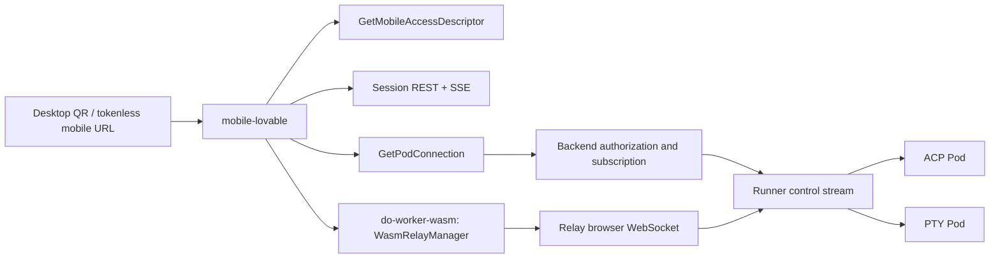
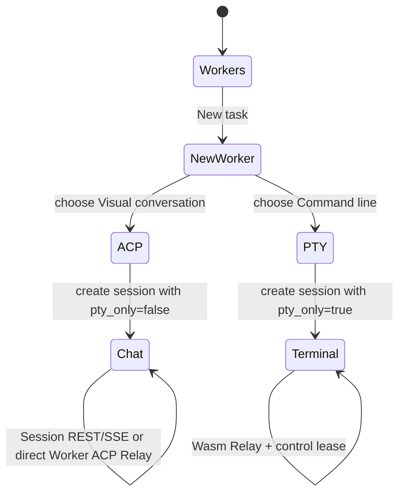

# Mobile Worker Dual-Mode Design

**Status:** implemented locally; production release blocked by an outdated Backend Worker contract
**Date:** 2026-07-12
**Scope:** make `clients/mobile-lovable` the supported mobile Worker entry point.

## Goal

Users can open a Worker from a mobile browser and select a clear interaction
path when creating it:

1. ACP visual conversation for Codex and other ACP-capable agents.
2. PTY command line for Codex CLI and terminal-first agents.

Both paths use the existing organization identity, RBAC, Pod lifecycle, Relay,
Runner, and token issuer. Mobile does not introduce a gateway, a relay, or a
terminal protocol of its own.

## Runtime constraint

`Pod.interaction_mode` is fixed when the Runner starts the Pod:

| Mode | Runtime | Mobile surface |
| --- | --- | --- |
| `acp` | ACP agent process | structured chat, tool activity, approvals |
| `pty` | terminal process | xterm command line |

A running Pod cannot safely switch between these modes. The mobile UI must not
present a toggle that implies it can. A user chooses the mode when creating a
Worker; a later "switch mode" action creates a separate Worker with the same
project/workspace context. Linking or cloning those Workers is out of this
delivery.

## Current-state findings

`clients/mobile-lovable` is the `@do-worker/mobile` workspace package. It has a
dedicated image, OILAN Deployment, Service, ingress, CI validation, and local
host-service support. It retains Session REST/SSE for session-centric work and
adds direct Worker routes for mobile QR/canonical links.

The writable PTY path and direct ACP path use `WasmRelayManager`. They request
a short-lived browser connection through `GetPodConnection`, subscribe through
Relay, and explicitly acquire/release the control lease. The legacy terminal
attach endpoint is not on the new mobile terminal write path.

The supported Web client already uses `WasmRelayManager`, `GetPodConnection`,
and `useWorkerControlLease`. The mobile service must use the same primitives.

## Target architecture



Session routes own durable conversation persistence and command dispatch. Direct
Worker routes use Relay for ACP snapshots/events and PTY bytes, reconnect
behavior, and the control lease. Backend authorizes and subscribes Pods but
never proxies terminal bytes.

## API changes

The mobile contract has two authenticated organization-scoped Connect RPCs:

```text
GetMobileAccessDescriptor(org_slug, pod_key)
GetPodConnection(org_slug, pod_key)
```

`GetMobileAccessDescriptor`:

1. resolves organization scope and Pod read policy;
2. returns a token-free canonical URL, fixed `interaction_mode`, and
   console/preview/relay capabilities;
3. never returns a JWT, Relay token, preview token, or runner credential.

`GetPodConnection`:

1. resolves organization scope and Pod read policy;
2. rejects inactive, runnerless, unsubscribable, or Relay-unavailable Pods;
3. sends `SubscribePod` before minting the browser token;
4. returns `{ relay_url, token, pod_key }` and never a runner token.

The existing session relay endpoint remains for session-centric PTY pages.
Session list/get responses also project `interaction_mode`; clients must route
by this field, not by an agent name.

## Mobile product flow



Routes:

| Route | Responsibility |
| --- | --- |
| `/workers/:podKey` | load `GetMobileAccessDescriptor`, then open its fixed executable mode |
| `/workers/:podKey/chat` | ACP Relay chat with tool events, permissions, and control lease |
| `/workers/:podKey/terminal` | PTY Relay terminal with xterm and control lease |
| `/workers/:podKey/preview` | request a backend preview session and replace history with its session URL |
| `/sessions/:sessionId` | ACP chat session |
| `/sessions/:sessionId/terminal` | PTY terminal session |
| `/new` | select agent, workspace, and interaction mode |

For an ACP session, the terminal command is disabled and explains that the
Worker was started in conversation mode. For a PTY session, the chat command is
disabled and explains that the Worker was started in command-line mode. This is
an executable state, not a cosmetic tab state.

## Frontend implementation

1. Formalize `clients/mobile-lovable` as `@do-worker/mobile` in the pnpm
   workspace and add `do-worker-wasm` as a workspace dependency.
2. Add a mobile Relay adapter around `WasmRelayManager`. It accepts direct Pod
   connection information, exposes ACP events or terminal output/status, and
   owns subscribe/unsubscribe.
3. Add a mobile control-lease hook. It acquires control on explicit user
   action, renews before expiry, releases on page hide and unmount, and renders
   observer/acquiring/error states.
4. Replace `TerminalAttachPanel` with an xterm panel that uses this adapter.
   Remove the old terminal attach URL from the mobile write path.
5. Add `interaction_mode` to mobile Session types and creation payloads. New
   task presents two 44px touch targets with concise mode-specific labels.
6. Add `/workers/:podKey` and fixed-mode chat/terminal routes. QR/canonical
   links target the descriptor route; preview is only shown when the descriptor
   reports it available and always requests a backend-issued session URL.

## Deployment

The repository contains a dedicated mobile image, Kubernetes Deployment,
Service, ingress route, CI build validation, and an OILAN limited-reconcile
script. The deployment supplies:

```text
MOBILE_PUBLIC_BASE_URL=https://mobile.l8ai.cn
VITE_DO_WORKER_API_URL=https://dowork.l8ai.cn
```

Production uses HTTPS/WSS only. The QR URL contains the Worker identifier and
no JWT, Relay token, preview token, or one-time credential. Mobile users
authenticate normally before session data is returned.

The OILAN release uses a dedicated `mobile` Deployment, Service, and
`mobile.l8ai.cn` ingress. Relay's exact Origin allowlist includes
`https://dowork.l8ai.cn` and `https://mobile.l8ai.cn`. The canonical URL change
is made only when the mobile Deployment, ingress, DNS, and HTTPS health checks
are live. Existing desktop `/org/mobile/workers/:podKey` remains a supported
desktop route during migration; it is not a Relay protocol fallback.

The mobile release is a limited reconcile: it updates only the shared
ConfigMap, backend, Relay, mobile Deployment, and ingress resources. The three
affected application images are pinned by immutable digest before applying
them, so a mobile release cannot roll unrelated workloads back to stale
manifest versions.

## Exact change boundary

Included:

- `clients/mobile-lovable` Session creation, Worker route, Relay terminal,
  control lease, API client, tests, workspace/build configuration.
- `backend/internal/api/rest/v1/session` connection endpoint, session mode
  projection, route registration, Go tests.
- mobile image, OILAN Kubernetes manifests, CI/deploy image references, and
  operator documentation.

Excluded:

- a new Runner, relay, tunnel, QR token format, anonymous sharing, native app,
  or dynamic ACP/PTY transformation of an existing running Pod.
- unrelated Agent Mesh, worker catalog, model resource, and goal-loop changes.

## Acceptance checks

1. A mobile user creates a Codex ACP Worker and sends a message. The Session
   route renders response and tool events through SSE; a direct Worker route
   waits for the Relay confirmation carrying the same prompt request ID before
   treating the message as accepted.
2. A mobile user creates a Codex PTY Worker, taps Take control, types a
   command, resizes, backgrounds and returns. Release smoke sends Resize and
   Input frames and requires matching terminal output; input only works while
   the control lease is granted.
3. The browser never calls the legacy terminal attach endpoint for the new
   terminal panel. Direct ACP uses `GetPodConnection` and Relay ACP frames.
4. Unauthorized users cannot obtain a session relay token or resolve a private
   Worker by Pod key.
5. Go tests cover token ordering and failed-closed cases; Vitest covers mode
   serialization, mode routing, and lease lifecycle.
6. Browser tests cover ACP and PTY creation/success/error/observer states on
   desktop and mobile viewport. Production verification checks HTTPS, WSS,
   deployed health, and the two user paths.

## Verification status

Local verification has passed the mobile lint/typecheck/Vitest suite, Vite
production build, deployment-script contract, direct ACP Relay prompt
confirmation/round-trip, and PTY Relay snapshot, control, Resize, Input, and
matching output frame coverage.

As of 2026-07-13, `https://mobile.l8ai.cn/` and `/login` return HTTP 200, but
the production `codex-cli` Worker definition does not expose
`supported_modes=["acp","pty"]` or `requires_model_resource=true`.
The release smoke fails closed before Worker creation. The OILAN DoOps target
`gw-oilan-node` is also offline, so the cluster image revision and rollout
cannot be verified. Do not treat the public HTTP response as release
acceptance until the Backend/worker-definition rollout completes and the
interaction smoke passes.
