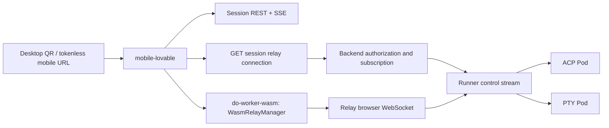
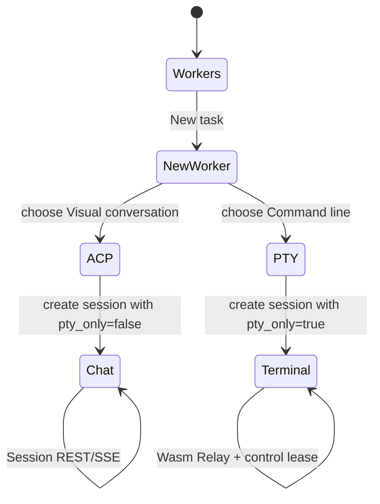

# Mobile Worker Dual-Mode Design

**Status:** approved for implementation
**Date:** 2026-07-12
**Scope:** make `clients/mobile-lovable` the supported mobile Worker entry point.

## Goal

Users can open a Worker from a mobile browser and select a clear interaction
path when creating it:

1. ACP visual conversation for Codex and other ACP-capable agents.
2. PTY command line for Codex CLI and terminal-first agents.

Both paths use the existing organization identity, RBAC, Pod lifecycle, Relay,
Runner, and token issuer. Mobile does not introduce a gateway, a relay, or a
terminal protocol of its own.

## Runtime constraint

`Pod.interaction_mode` is fixed when the Runner starts the Pod:

| Mode | Runtime | Mobile surface |
| --- | --- | --- |
| `acp` | ACP agent process | structured chat, tool activity, approvals |
| `pty` | terminal process | xterm command line |

A running Pod cannot safely switch between these modes. The mobile UI must not
present a toggle that implies it can. A user chooses the mode when creating a
Worker; a later "switch mode" action creates a separate Worker with the same
project/workspace context. Linking or cloning those Workers is out of this
delivery.

## Current-state findings

`clients/mobile-lovable` already renders Session API conversation data and has
a terminal page. It is not deployed as a product service, is absent from the
pnpm workspace and CI image matrix, and its terminal uses
`/v1/sessions/:id/resources/terminals/:terminal_id/attach`.

That attach endpoint translates old raw WebSocket traffic to Relay frames. It
does not acquire, renew, or release the Relay control lease. Since Relay now
requires a lease for input and resize, it cannot be the writable mobile
terminal implementation.

The supported Web client already uses `WasmRelayManager`, `GetPodConnection`,
and `useWorkerControlLease`. The mobile service must use the same primitives.

## Target architecture



The Session API owns conversation persistence and command dispatch. The Relay
owns browser data-plane bytes, ACP frames, reconnect behavior, snapshots, and
the control lease. Backend never proxies terminal bytes.

## API changes

Add an authenticated organization-scoped endpoint:

```text
GET /v1/sessions/:id/relay-connection
```

It must:

1. call `authorizeSession`;
2. reject missing, inactive, or runnerless Pods;
3. select a healthy Relay with the tenant organization affinity;
4. issue the Runner subscription token;
5. send `SubscribePod` before issuing the browser token;
6. return `{ relay_url, token, pod_key }`.

The response must never include a runner token. Missing Relay manager, token
generator, command sender, unhealthy Relay, or subscription failure is a
service error; there is no alternate WebSocket path.

Session list and get responses add `interaction_mode` from the associated Pod.
The field lets mobile route a session to its only executable surface without
guessing from an agent name.

## Mobile product flow



Routes:

| Route | Responsibility |
| --- | --- |
| `/workers/:podKey` | resolve `GET /v1/sessions/by-pod/:podKey`, then open its executable mode |
| `/sessions/:sessionId` | ACP chat session |
| `/sessions/:sessionId/terminal` | PTY terminal session |
| `/new` | select agent, workspace, and interaction mode |

For an ACP session, the terminal command is disabled and explains that the
Worker was started in conversation mode. For a PTY session, the chat command is
disabled and explains that the Worker was started in command-line mode. This is
an executable state, not a cosmetic tab state.

## Frontend implementation

1. Formalize `clients/mobile-lovable` as `@do-worker/mobile` in the pnpm
   workspace and add `do-worker-wasm` as a workspace dependency.
2. Add a mobile Relay adapter around `WasmRelayManager`. It accepts connection
   information from the session endpoint, exposes terminal output/status, and
   owns subscribe/unsubscribe.
3. Add a mobile control-lease hook. It acquires control on explicit user
   action, renews before expiry, releases on page hide and unmount, and renders
   observer/acquiring/error states.
4. Replace `TerminalAttachPanel` with an xterm panel that uses this adapter.
   Remove the old terminal attach URL from the mobile write path.
5. Add `interaction_mode` to mobile Session types and creation payloads. New
   task presents two 44px touch targets with concise mode-specific labels.
6. Add `/workers/:podKey` and make QR/canonical links target that route after
   the mobile public base URL is configured.

## Deployment

Add a dedicated mobile image, Kubernetes Deployment, Service, ingress route,
and CI image build. The deployment supplies:

```text
MOBILE_PUBLIC_BASE_URL=https://mobile.l8ai.cn
VITE_DO_WORKER_API_URL=https://dowork.l8ai.cn
```

Production uses HTTPS/WSS only. The QR URL contains the Worker identifier and
no JWT, Relay token, preview token, or one-time credential. Mobile users
authenticate normally before session data is returned.

The OILAN release adds a dedicated `mobile` Deployment, Service, and
`mobile.l8ai.cn` ingress. Relay's exact Origin allowlist includes
`https://dowork.l8ai.cn` and `https://mobile.l8ai.cn`. The canonical URL change
is made only when the mobile Deployment, ingress, DNS, and HTTPS health checks
are live. Existing desktop `/org/mobile/workers/:podKey` remains a supported
desktop route during migration; it is not a Relay protocol fallback.

The mobile release is a limited reconcile: it updates only the shared
ConfigMap, backend, Relay, mobile Deployment, and ingress resources. The three
affected application images are pinned by immutable digest before applying
them, so a mobile release cannot roll unrelated workloads back to stale
manifest versions.

## Exact change boundary

Included:

- `clients/mobile-lovable` Session creation, Worker route, Relay terminal,
  control lease, API client, tests, workspace/build configuration.
- `backend/internal/api/rest/v1/session` connection endpoint, session mode
  projection, route registration, Go tests.
- mobile image, OILAN Kubernetes manifests, CI/deploy image references, and
  operator documentation.

Excluded:

- a new Runner, relay, tunnel, QR token format, anonymous sharing, native app,
  or dynamic ACP/PTY transformation of an existing running Pod.
- unrelated Agent Mesh, worker catalog, model resource, and goal-loop changes.

## Acceptance checks

1. A mobile user creates a Codex ACP Worker and sends a message; the ACP
   response and tool events render through Session SSE.
2. A mobile user creates a Codex PTY Worker, taps Take control, types a
   command, resizes, backgrounds and returns; input only works while the
   control lease is granted.
3. The browser never calls the legacy terminal attach endpoint for the new
   terminal panel.
4. Unauthorized users cannot obtain a session relay token or resolve a private
   Worker by Pod key.
5. Go tests cover token ordering and failed-closed cases; Vitest covers mode
   serialization, mode routing, and lease lifecycle.
6. Browser tests cover ACP and PTY creation/success/error/observer states on
   desktop and mobile viewport. Production verification checks HTTPS, WSS,
   deployed health, and the two user paths.
