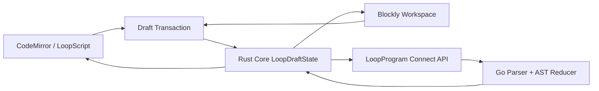

# Loop 代码与积木双向同步详细设计

- 日期：2026-07-14
- 状态：待评审
- 依赖：LoopScript 语言与 AST、积木目录设计

## 1. 同步架构



后端是解析和语义更新的最终权威。Rust Core 是浏览器业务状态 SSOT；React、CodeMirror 和 Blockly 只是视图与输入适配器。

## 2. Draft 状态

```text
LoopDraftState
  program_slug
  revision
  semantic_revision
  source_text
  parse_status
  ast
  diagnostics[]
  block_view_state
  active_editor
  pending_transaction
  client_sequence
  last_server_hash
```

状态规则：

- `revision` 随每次持久化文本或语义修改递增。
- `semantic_revision` 只在有效 AST 更新时递增。
- `source_text` 保存用户最新文本，包括无效文本。
- `ast` 保存最后一次服务端确认的有效语义，并对应 `semantic_revision`。
- `block_view_state` 只含坐标、折叠、缩放和选中节点。
- `active_editor` 为 `code` 或 `blocks`，同一时刻只有一个结构写入者。
- 未确认事务不覆盖已确认 revision。

## 3. Code 到 Blocks

1. CodeMirror 产生 origin=`code` 的文本事务。
2. Rust Core 更新本地 source，并标记 `parsing`。
3. 300ms debounce 后发送 `UpdateLoopDraftSource(base_revision, source_text)`。
4. 后端持久化文本并返回 revision、semantic revision、AST、诊断和 source hash。
5. 有效时，Core 替换 AST，Blockly 按 node id 做增量 diff。
6. 无效时，代码保留，积木保持最后有效结构并进入只读状态。

Core 同时只允许一个 draft write 在途；每个请求携带唯一 `client_transaction_id` 和单调 `client_sequence`。期间的新文本合并为最新 pending source，在响应后使用新 revision 继续提交。
过期响应按 request revision 丢弃。无效文本仍产生新 revision，但不改变 semantic revision。用户不能在语法错误未解决时切换到积木结构编辑。

## 4. Blocks 到 Code

1. Blockly change listener 把 UI 事件转换为语义命令，不直接生成代码。
2. Core 发送 `ApplyDraftCommand(base_revision, command)`。
3. 后端在 AST reducer 中校验命令并生成新 AST。
4. formatter 输出 canonical source，响应包含 AST、source 和 diagnostics。
5. Core 原子替换状态；CodeMirror 用 origin=`blocks` 的事务更新文本。

origin 防止 CodeMirror 更新再次触发同一条业务事务。被拒绝的命令恢复服务端 revision，并展示明确冲突，不保留半成功结构。

## 5. 单写者模型

同一浏览器采用编辑焦点锁：

- 代码模式允许文本写，积木可观察、选择和定位。
- 积木模式允许结构写，代码只读并实时更新。
- 参数检查器跟随当前 active editor。
- 切换模式前必须完成或取消 pending transaction。

该限制只约束结构写入，不影响两个视图同时显示和高亮。

## 6. Revision 与冲突

首期不做多人实时合并，使用 optimistic revision：

```text
request.base_revision == current_revision
```

不相等时返回：

```text
code: revision-conflict
current_revision
current_source
current_ast
```

客户端提供查看差异、重新应用和放弃本地修改，不自动 last-write-wins。

## 7. API

```text
CreateLoopProgram
GetLoopProgram
GetLoopDraft
UpdateLoopDraftSource
ApplyLoopDraftCommand
UpdateLoopViewState
PublishLoopProgram
ListLoopProgramVersions
```

关键请求必须包含 `org_slug`、program slug 和 `base_revision`。identifier 均由服务层通过 `slugkit` 校验或生成。

## 8. 浏览器状态接入

正式实现新增 Rust Core `LoopState` 并挂入共享 `AppState`。状态、服务和事件通过同一个 `AppRuntime` 暴露给 WASM；禁止在 React local state 或 Zustand 建立第二份业务草稿。

React 可保留：

- 面板开合、tab 和临时 hover；
- CodeMirror view 实例；
- Blockly workspace 实例；
- 未提交的输入法组合状态。

任何会影响发布语义的字段都必须进入 Rust Core。

## 9. Draft 存储

### `loop_programs`

保存组织内稳定 identity：`id`、`organization_id`、`slug`、`name`、`draft_revision`、`semantic_revision`、`latest_published_version_id`、timestamps。

### `loop_program_drafts`

保存：

- `source_text`；
- `ast_proto`；
- `diagnostics_json`；
- `block_view_state_json`；
- `revision`、`semantic_revision`、`updated_by_id`。

语义更新使用 revision compare-and-swap。视图状态可单独节流写入，但必须携带对应 revision，不能把旧布局覆盖到新 AST。

## 10. 错误状态

| 状态 | 代码可写 | 积木可写 | 可发布 |
| --- | --- | --- | --- |
| valid | 取决于 active editor | 取决于 active editor | 是 |
| parsing | 是 | 否 | 否 |
| syntax-error | 是 | 否 | 否 |
| type-error | 是 | 否 | 否 |
| revision-conflict | 否 | 否 | 否 |
| publishing | 否 | 否 | 否 |

不支持语法、未知节点和投影失败均视为阻塞错误，不保留“部分可编辑”的结构。

## 11. BDD 验收

### 积木改代码

- Given 有效 program revision 7
- When 用户拖入 `verify tests` 并填写命令
- Then 服务端产生 revision 8，代码出现等价节点，node id 一致。

### 代码改积木

- Given 用户处于代码模式
- When 新增合法 `repeat fix-cycle`
- Then AST 通过校验，积木区出现对应 C 型积木和子节点。

### 非法代码

- Given revision 8、semantic revision 8 有有效 AST
- When 用户输入未闭合 block
- Then 文本以 revision 9 保存，发布被禁用，积木保持 semantic revision 8 且只读。

### 并发冲突

- Given 客户端基于 revision 8 编辑
- When 服务端已存在 revision 9
- Then 写入被拒绝并显示差异，不覆盖 revision 9。

## 12. 测试

- parser/formatter round-trip；
- AST command reducer 单元测试；
- node id 到 block/source 双向索引测试；
- stale response 与 revision conflict 测试；
- 输入法、撤销/重做和模式切换测试；
- 浏览器真实拖拽、代码输入、错误恢复和刷新恢复测试；
- console、network error 和桌面/移动截图验证。
