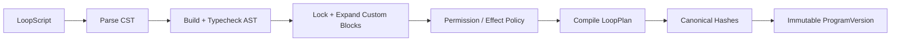

# Loop 发布与版本治理详细设计

- 日期：2026-07-14
- 状态：待评审
- 依赖：LoopScript、积木目录、双向同步设计

## 1. 发布管线



任一步失败都不创建版本。发布事务必须锁定准确的 WorkerSpec snapshot、自定义积木版本、Verifier 配置和 compiler version。

## 2. ProgramVersion

`loop_program_versions` 不可变保存：

- program id、version number；
- source、AST protobuf、compiled plan protobuf；
- source/AST/plan SHA-256；
- language、schema、compiler version、compile target；
- execution dependency lock、custom block lock、expansion source map；
- publisher、published_at。

发布后修改产生新版本。历史运行固定引用原版本，不能读取最新草稿。

## 3. 发布前检查

按固定顺序执行：

1. parser 与 AST schema 校验；
2. identifier 唯一性和引用完整性；
3. 自定义积木锁定和宏展开；
4. WorkerSpec snapshot 存在性和组织归属；
5. Verifier、权限、Secret 与 effects policy；
6. 循环退出、预算、人工升级和不可逆动作审批；
7. 目标编译器能力检查；
8. canonical source、AST 和 plan hash。

检查结果包含稳定 diagnostic code 和 node id。发布 API 不接受客户端声明“已校验”。

## 4. 发布事务

```text
begin transaction
lock loop_program
compare draft revision
reparse source
compile immutable plan
insert program version
update latest_published_version_id
commit
```

revision 不一致、依赖版本变化或 hash 不一致时整体回滚。版本号按 program 内单调递增生成。

## 5. 执行依赖锁

`LoopExecutionDependencyLock` 固定 WorkerDefinition revision/hash、WorkerSpec snapshot hash、Skill revision/content hash、MCP package/server/schema hash、Verifier image/profile hash和模型策略引用。

Secret 值和短期凭证不进入版本，只记录运行时 binding identity。若当前 WorkerSpec 无法解析到不可变 Skill/MCP 内容，发布失败；不能只锁 snapshot id 后在运行时读取最新内容。

## 6. Proto 演进

AST 与 plan proto 遵守：

- 删除字段必须 `reserved` 原编号和名称；
- 新字段使用新编号，不改变旧字段语义；
- 每个根消息携带 `schema_version`；
- compiler version 单独记录，不用 schema version 表示实现版本；
- 旧 compiler 不认识的新 node kind 必须拒绝，不按 unknown JSON 跳过。

参考：[Protocol Buffers updating messages](https://protobuf.dev/programming-guides/proto3/#updating)

## 7. API

```text
PublishLoopProgram(target, expected_revision)
ListLoopProgramVersions
GetLoopProgramVersion
DeprecateLoopProgramVersion
CompareLoopProgramVersions
```

已发布版本不能 update 或 delete。`Deprecate` 只阻止新运行，不影响历史查询和已开始运行。
target 必须显式为 `goal-loop-v1` 或 `loop-plan-v2`，不自动选择，也不在失败后切换。

## 8. GoalLoop V1 编译

V1 adapter 把受支持 AST 映射到：

- `worker_spec_snapshot_id`；
- 拼接后的 objective；
- acceptance criteria；
- verification command；
- max iterations、token、timeout、no-progress、same-error；
- escalation policy。

发布阶段只生成不可变 `GoalLoopLaunchSpec`。启动运行时才创建 GoalLoop，并写入 `program_version_id` 和 `plan_hash`。当 AST 包含多个 Worker、人工确认、分支或多个独立 Verifier 时，V1 编译返回 target 错误。

## 9. 版本验收

### 不可变发布

- Given draft revision 12 已通过校验
- When 用户发布 version 3
- Then source、AST、plan、依赖锁和 hash 原子保存，后续 draft 修改不影响 version 3。

### 依赖漂移

- Given 发布请求引用 custom block version 2
- When 事务开始前该版本已废弃或不可用
- Then 发布失败且不产生部分 version。

### 编译目标不支持

- Given 程序包含 ApprovalNode
- When 目标为 `goal-loop-v1`
- Then 返回 compile-target 错误，不创建 GoalLoop 或 ProgramVersion。

## 10. 测试

- 同一 source 重复编译产生相同 AST/plan hash；
- 发布事务 revision race；
- WorkerSpec/custom block 组织隔离；
- proto unknown node 和旧 compiler 拒绝；
- V1 支持矩阵逐节点测试；
- 发布后 draft 修改不影响历史版本；
- migration up/down 和 identifier check。
