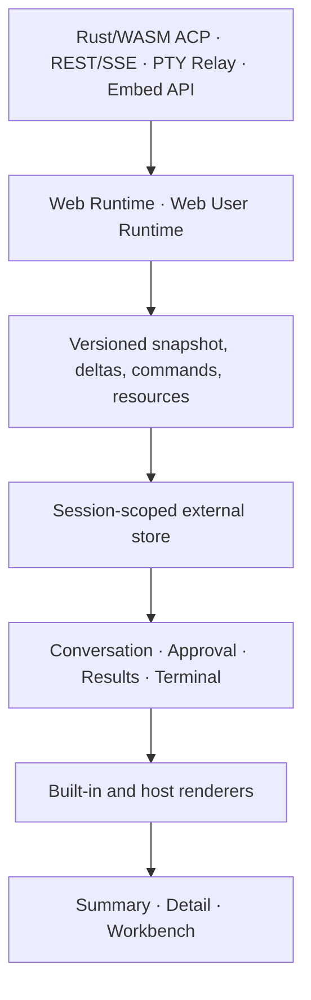

# Agent Workbench V2 Design

**Status:** proposed for implementation  
**Date:** 2026-07-15  
**Scope:** shared Agent protocol, React workbench, tool renderers, result viewers, Web/Web User adapters, page mounting, and iframe embedding.

## 1. Product Definition

Agent Workbench helps a user direct an Agent, inspect its actions, approve risky operations, review generated results, and continue editing without leaving the task. Conversation is the control thread; tools, terminals, files, previews, and media are task resources rather than separate modules.

The target supports Codex, Claude, Gemini, Aider, ACP-compatible agents, and business tools without adding tool-name switches to conversation code.

## 2. Evidence And Supersession

`packages/agent-ui/src/contracts.ts` compresses rich execution data into `title`, `detail`, `input`, and `output`. Both `clients/web-user/src/embed-session/embeddedTimelineProjection.ts` and `clients/web/src/components/workspace/agent-ui/webAcpSnapshot.ts` perform lossy projection. `packages/agent-ui/src/toolPresentation.ts` then guesses the tool kind from display-name substrings.

`clients/web-user/src/shell/FileViewer.tsx` already contains mature code, Markdown, HTML, image, diff, review, and file behavior. The shared `ArtifactCard` duplicates a smaller subset. V2 extracts the mature capability instead of extending the duplicate.

This design supersedes the flattened protocol and native-renderer-slot conclusions in `2026-07-13-agent-conversation-integration-design.md`, the shared snapshot and presentation sections of `2026-07-13-agent-workspace-recovery-design.md`, and the artifact polling/inline-card presentation in `2026-07-14-pod-workspace-artifacts-design.md`.

It preserves the implemented embed-context redemption protocol, terminal control lease, Pod-scoped filesystem authorization, and Rust Core ownership.

## 3. Architecture

Use one physical package with tree-shakeable subpath exports:

```text
@do-worker/agent-ui/protocol
@do-worker/agent-ui/runtime
@do-worker/agent-ui/react
@do-worker/agent-ui/embed
```



Runtime owns durable and recoverable state. React owns only draft text, scroll anchors, open state, result selection, modal state, and split ratio.

Web retains Rust Core as business-state SSOT. Snapshot and delta reduction must be atomic in Rust before one revision notification. Zustand may mirror ticks/projections but cannot mutate session, turn, tool, permission, command, artifact, or resource state.

## 4. Protocol V2

Every ordered item carries:

```ts
interface AgentEventEnvelope {
  sessionId: string;
  streamEpoch: string;
  revision: number;
  sequence: number;
  turnId: string;
  itemId: string;
  parentId?: string;
  agentId?: string;
  createdAt: string;
}
```

Timeline variants are `message`, `reasoning`, `tool_execution`, `plan`, `artifact_reference`, `approval`, `status`, `error`, and `system`.

Messages contain typed parts: `text`, `markdown`, `image`, `audio`, `file`, `citation`, and `artifact_ref`. Adapters must not discard unsupported parts.

A tool execution contains stable identity, namespace, semantic key, version, category, phase, structured input, optional progress, result blocks, artifact references, actions, timing, executor context, retry lineage, and approval ID. Phases are `queued`, `running`, `waiting_approval`, `completed`, `failed`, and `cancelled`.

Commands use one `execute(CommandEnvelope)` contract and return a receipt. Receipts and events correlate by `commandId`; sending, interrupting, configuration changes, approvals, artifact actions, and extension commands share the lifecycle. UI does not remove permissions or optimistic items until Runtime publishes accepted or terminal state.

Capabilities declare protocol version, command schemas, models, permission modes, attachments, history, terminal operations, artifact operations, and versioned extensions. Controls never infer support from Agent names.

## 5. Renderer Registry

Trusted hosts register renderers by exact semantic key and supported version:

```ts
interface ToolRendererRegistration {
  toolKey: string;
  versions: readonly string[];
  summary?: ToolSummaryRenderer;
  detail?: ToolDetailRenderer;
  workbench?: ToolWorkbenchRenderer;
}
```

Built-ins cover shell, file read/write/diff, search, browser, HTTP, image generation/editing, video generation/playback, documents, presentations, spreadsheets, tables, workflows, and generic structured output.

Unregistered keys render an explicit unsupported-tool surface containing key, version, phase, and inspectable structured blocks. It does not pretend to be specialized and does not classify from display text.

Trusted same-bundle hosts may register React renderers. Remote or untrusted tools may return standard content blocks or a restricted iframe descriptor; they may not provide a JavaScript module URL.

## 6. Content And Artifact Model

Standard result blocks include text, Markdown, code, JSON, table, diff, command, log, progress, error, image, image comparison, annotation, video, audio, HTML, live preview, PDF, presentation, spreadsheet, file, link, and restricted iframe.

Artifacts live in a session catalog rather than loading inside every timeline card. A descriptor includes stable ID, revision, filename, media type, role, status, size, dimensions, duration, provenance, representations, and actions.

Representations separate original files from browser previews:

- PPTX/DOCX: original plus PDF, HTML, thumbnails, or page images.
- Video: original plus playable derivative, poster, and thumbnails.
- Image: source, edited result, thumbnail, mask, and revisions.
- HTML: source text plus isolated preview.

Missing previews produce an explicit unsupported-preview state with original download. The frontend never fabricates a successful preview.

## 7. UI Composition

```text
AgentWorkbench
├── ConversationSurface
│   ├── TurnTimeline
│   ├── ToolExecutionGroup
│   ├── ApprovalQueue
│   └── AgentComposer
├── ResultWorkbench
│   ├── ResourceRail
│   ├── ArtifactViewer
│   ├── ToolWorkbench
│   ├── LivePreviewSurface
│   └── ResultInspector
└── TerminalWorkspace
```

Desktop embeds use a resizable conversation/results split with a result rail. Mobile uses full-width Conversation and Results tabs. Terminal is a declared resource, not an ACP socket relabeled as a terminal.

Tool command details are collapsed by default. Running items show compact progress; failures and pending approvals open automatically. Completed tools may select a declared primary result. Auto-open is an explicit presentation hint and respects a user's pinned selection.

## 8. Media Interaction

Image rendering supports fit, zoom, pan, source/result switching, side-by-side, overlay and slider comparison, region selection, free annotation, masks, candidate versions, and download. Coordinates, annotation data, mask artifact, and editing instruction return through a typed artifact action command. Pixel-level crop, filters, layers, and painting are trusted plugin renderers.

Video rendering supports queued/rendering/transcoding progress, poster, metadata, playback, seek, volume, speed, fullscreen, version selection, timestamp review comments, derivatives, and download. Runtime snapshots restore long-running progress after reconnect.

## 9. Security Profiles

HTML artifacts run in an opaque-origin sandbox without `allow-same-origin`. Live Pod previews use only backend-issued preview session URLs and a separate profile. Remote renderer iframes require exact origins, capability allowlists, protocol versions, and validated messages.

Markdown blocks remote tracking resources by default. SVG is active content and is never injected into the host DOM. Workspace paths are relative and reject empty, dot, parent, and absolute segments. Truncated content is read-only. Terminal writes require capability, writable state, and control lease.

The existing one-time embed context, parent-held redemption proof, exact parent origin validation, session-bound token, and route capability enforcement remain the iframe authorization contract.

## 10. Integration Entries

- React: `<AgentWorkbench runtime registry sessionId />`
- Atoms: `<ConversationSurface />`, `<ResultWorkbench />`, `<TerminalWorkspace />`
- Plain page: `mountAgentWorkbench(element, options)`
- Iframe: capability-scoped `/iframe.html?embed_context=...`

Mounting and iframe APIs expose locale, theme tokens, initial surface, host actions, and renderer registration without exposing credentials.

## 11. Migration

1. Add V2 contracts, fixtures, command receipts, and renderer registry.
2. Extract artifact loading and pure renderers from Web User one renderer at a time; switch Web User immediately and delete the replaced implementation.
3. Add ResultWorkbench and built-in code, diff, Markdown, HTML, image, video, PDF, and presentation renderers with dynamic heavy dependencies.
4. Replace Web User's lossy embedded projection with V2 block preservation.
5. Publish atomic Rust session snapshots and replace Web's TS reconstruction.
6. Normalize permission, artifact, history, terminal, and command state.
7. Add React, imperative mount, and iframe V2 entries.
8. Remove full inline ArtifactCard previews, tool-name guessing, duplicate renderers, and V1 contracts in the same release migration.

There is no runtime transport fallback. During development each host selects one explicit adapter; unsupported V2 data fails visibly.

## 12. Acceptance

Contract fixtures must render identically in Web, Web User, plain mount, and iframe. Browser verification covers desktop and 390px mobile, loading, empty, streaming, reconnect, error, disabled, approval, read-only, and control states.

Real Runner tasks must prove:

- programming: collapsed commands, file diff, code artifact, and live HTML;
- image: generation, comparison, annotation/mask, and continued edit;
- presentation: original PPTX plus browser preview;
- video: durable progress, reconnect recovery, playback, and download;
- permissions: approve, reject, expired, and read-only iframe;
- terminal: multiple resources, observer mode, lease acquisition, and input.

Completion requires successful network evidence, no new console errors, screenshots for desktop/mobile/embed, and no duplicated renderer remaining in Web User or the old ArtifactCard path.
