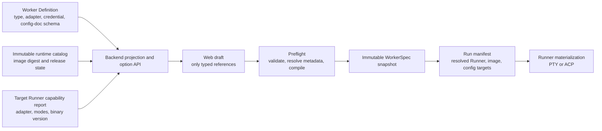

# Worker Integration Runtime Architecture

## Status

- Date: 2026-07-16
- Status: Proposed, awaiting product confirmation before API or form changes
- Scope: every formal Worker type, its runtime image, Runner adapter, credentials,
  configuration documents, create form, and execution evidence

## Current Facts

The formal catalog has 13 Worker types in
`config/worker-types/catalog.json`. A Definition already declares the executable,
`adapter_id`, supported interaction modes, model requirement, credential bindings,
configuration documents, and version probe.

The current Runner integration is uneven:

| Runtime class | Worker types | Current integration |
| --- | --- | --- |
| ACP-capable | Claude, Codex, Cursor, Do Agent, Gemini, Grok, Loopal, OpenCode, Seedance | Definition declares an ACP adapter; Seedance intentionally shares Do Agent |
| PTY-only | Aider, Hermes, MiniMax, OpenClaw | Terminal lifecycle is required; only Aider, Hermes, and OpenClaw have dedicated Runner packages |

MiniMax has a `minimax-pty` Definition but no dedicated Runner agent package.
It is generic PTY execution, not a custom adapter. Loopal's local image contains
the E2E mock artifact and fails its declared version probe, so it is blocked.

`WorkerSpecDraft` carries `config_bundle_ids`, but configuration-document
declarations are only parsed and validated. The compiler emits unnamed
`USE_CONFIG_BUNDLE` declarations. It does not retain Definition
`config_documents[].id`, `format`, or `target_path`. The current Web selector
accepts one JSON file regardless of the selected Definition. This breaks the
configuration-document contract for Do Agent, OpenClaw, and Seedance.

## Decisions

1. `config/worker-types/<slug>/definition.json` remains the integration SSOT.
   No Runner package, form, or release catalog may introduce a second list of
   Worker types or credential names.
2. A Worker type is not formally supported because it has a Definition or a
   local image. Formal support requires a released image, compatible online
   Runner, credential/config materialization, successful lifecycle evidence,
   and browser evidence.
3. A WorkerSpec expresses desired placement through compute target, deployment
   mode, and policy. The selected physical Runner is a scheduling result stored
   in the run manifest, not a normal create-form field.
4. `source_expert_id` is import lineage. It is set only by importing an Expert
   and must remain read-only in the create form.
5. Secret values never enter WorkerSpec, preflight output, browser state,
   logs, or generated AgentFile. Model-resource bindings and credential-bundle
   references use different resolution paths and must remain distinct.

## Target Boundaries



### Definition Plane

The Definition owns product semantics:

- `adapter_id` selects the Runner protocol integration.
- `interaction_modes` limits terminal versus ACP behavior.
- `credential_bindings` declares which model resource or credential bundle can
  supply each environment variable.
- `config_documents` declares a logical document ID, format, and internal
  materialization target.

The runtime catalog only owns immutable image availability. It must never
silently make an unsupported Definition selectable.

### Credential Plane

There are two valid credential paths:

| Source | Examples | Form behavior | Runtime behavior |
| --- | --- | --- | --- |
| Model resource | Codex, Claude, Gemini, MiniMax, Do Agent, OpenClaw, Hermes, Seedance | Select compatible resource by protocol | Backend resolves and injects Definition-declared environment fields |
| Credential bundle | Aider, Cursor, Grok, Loopal | Select encrypted bundle through a typed secret reference | Backend validates the bundle against the exact declared field and injects it |

The create form must render only fields derived from the selected Definition.
It must never ask the user for a raw API key in the Worker creation request.

### Configuration-Document Plane

Replace the untyped `config_bundle_ids: number[]` create contract with:

```text
config_document_bindings: [
  { document_id: "settings", config_bundle_id: 42 }
]
```

`document_id` must match the selected Definition. The backend resolves
`format` and `target_path` from that Definition; the browser does not submit a
path. A binding is valid only when the referenced bundle has the required
kind and parseable document format.

This is a deliberate contract migration, not a fallback. Existing stored
snapshots must be migrated atomically before the old field is removed. The
AgentFile compiler and Runner command must receive the resolved document ID,
format, target path, content hash, and bundle revision in the run manifest.

The Web form becomes a Definition-driven document list. A Worker with no
declared documents shows no selector. A Worker with multiple documents renders
one named binding per declaration. Upload validation uses the declared format,
not a global JSON-only rule.

### Runner Adapter Plane

The target Runner report is authoritative for transport capability, not the
Docker tag. The current protocol only sends `available_agents` plus
`AgentVersionInfo { slug, version, path }`; it does not attest `adapter_id`,
interaction modes, or runtime-image digest. `ListWorkerCreateOptions` therefore
tests only whether an online Runner reports the Definition slug. It must not
claim that an ACP or PTY adapter is compatible until the protocol is extended
and the selection query validates that new capability evidence.

For every Definition, the release gate must prove:

1. the runtime image contains the declared executable and has an immutable
   digest;
2. the Runner reports the Definition's `adapter_id` and supported modes;
3. PTY Workers start and expose terminal lifecycle events;
4. ACP Workers complete initialize, session creation, prompt dispatch, and
   terminal cleanup;
5. the exact credential and configuration-document targets reach the runtime
   without exposing their values.

MiniMax must either gain a dedicated `minimax-pty` Runner adapter contract or
be explicitly documented and tested as generic PTY. Loopal cannot enter the
release catalog until its real binary replaces the mock artifact.

## API and Web Contract

`ListWorkerCreateOptions` becomes the complete public projection for the
selected Definition: runtime choices, typed config schema, required model
roles, secret-reference fields, and configuration-document declarations.

`PreflightWorker` stays metadata-only for provider credentials. It validates
every reference, config-document binding, image, placement, and Runner
compatibility, then compiles a redacted resolved spec. `CreatePod` repeats the
same resolution before it persists a snapshot; a prior preflight success is
not a permission bypass.

The Web uses one reducer-backed draft and this order:

1. choose Worker type, model resources, image, compute target, deployment mode,
   resource profile, and explicit/automatic placement policy;
2. complete Definition-specific fields, credential references, and named
   configuration documents;
3. select repository, Skills, knowledge, environment, instructions, and
   lifecycle;
4. run preflight, display every block, then create.

## Execution Loop

### Large Loop: Catalog Release Audit

For each formal Worker slug, maintain evidence for Definition, image digest,
Runner capability, credentials, config documents, preflight, Pod lifecycle,
provider interaction, browser path, cleanup, and release decision. A failed
gate blocks only that Worker; it never changes support state for another.

### Small Loop: One Worker

1. Read its Definition and Runner adapter package; classify it as PTY, ACP, or
   generic PTY.
2. Build or pull the declared image and run the declared probe with no network.
3. Verify the Runner capability report matches executable, adapter, and modes.
4. Validate credential and configuration-document form contracts without
   decrypting or logging secrets.
5. Run authenticated preflight; then, with authorized test credentials, create,
   connect, send one harmless prompt, observe the expected protocol event, and
   terminate the Pod.
6. Run the same path in the browser, collecting console, network, and
   screenshot evidence.
7. Record the immutable image digest, evidence paths, cleanup result, and
   support decision. Only all-green gates permit release publication.

## Completion Standard

The module is complete only when every release-supported Worker has passed the
small loop on its published digest. Definitions with missing images, missing
Runner support, invalid configuration bindings, provider failures, or blocked
browser tests remain visible but non-selectable with the verified reason.
