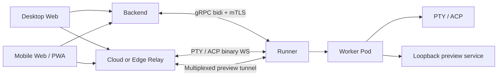
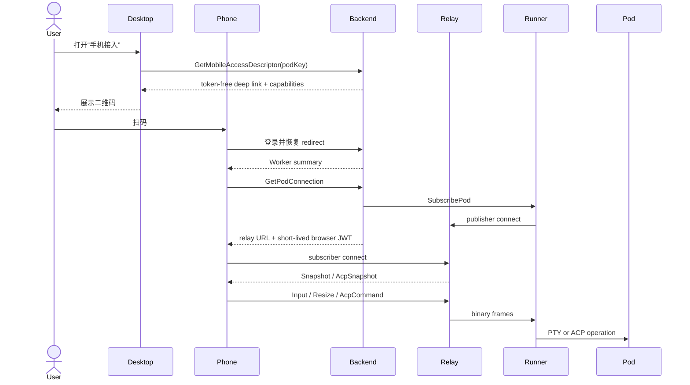
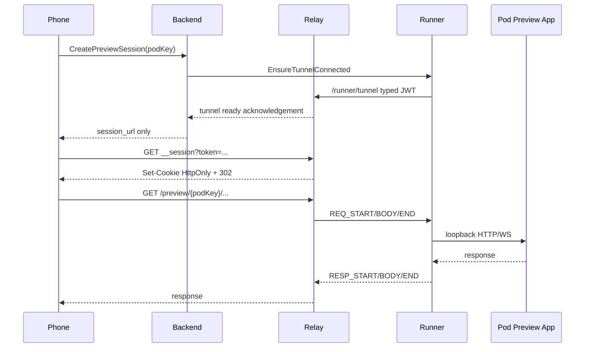
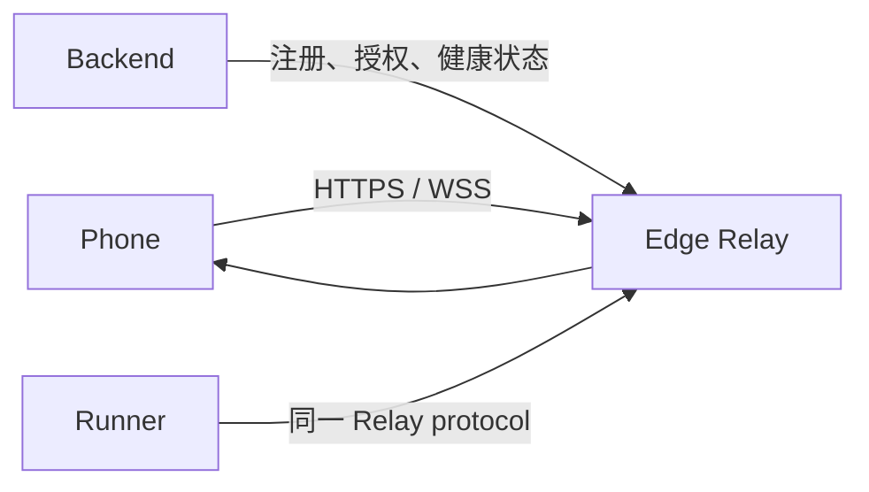
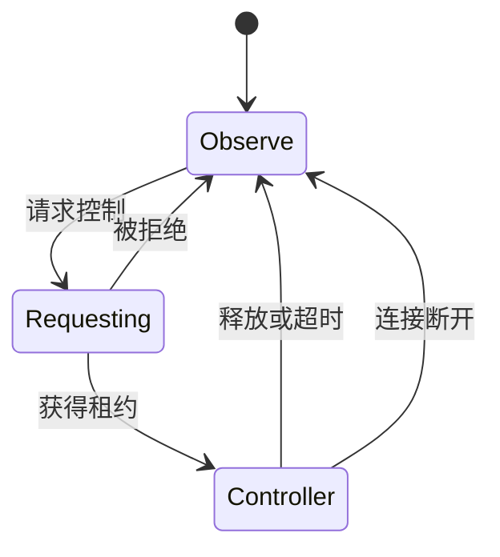

# 目标架构与时序

## 1. 总体架构



控制面和数据面必须保持分离：

- Backend 负责认证、授权、连接编排和审计。
- Relay 负责 PTY/ACP 字节与 Preview 流量。
- Runner 只建立出站连接，不暴露公共管理端口。
- 手机不直接访问 Runner gRPC。

## 2. Phase 1 云端接入



`SubscribePod` 失败时 Backend 必须返回 `Unavailable`，不得签发 Browser
Token。手机页面显示 Runner 未连接或 Relay 建链失败。

## 3. Preview 时序



设计要求：

- Backend 只有在 tunnel ready 后才签发 Preview session。
- API 响应不返回独立 `token` 字段。
- 手机只跳转 `session_url`。
- Preview Cookie 限定 Pod path。
- Runner tunnel 必须维护重连状态机。

## 4. Phase 2 局域网 Edge Relay



Edge Relay 不是 Runner 内置 Gateway。它必须：

- 运行标准 Relay 实现
- 使用 Backend 签发的 typed JWT
- 使用 HTTPS/WSS 和可信证书
- 注册健康状态与可达地址
- 使用相同 PTY/ACP 和 Tunnel 帧
- 由用户显式选择“局域网”

Backend 返回连接候选，但不静默切换：

```json
{
  "mode": "cloud",
  "candidates": [
    {"id": "relay-cloud-1", "kind": "cloud", "status": "ready"},
    {"id": "relay-edge-7", "kind": "edge", "status": "ready"}
  ]
}
```

用户选择 Edge 后，如果手机无法到达，页面显示：

- DNS/TLS 失败
- Relay 不健康
- 手机不在允许网络
- Runner 未连接到该 Edge

## 5. 多端控制

默认采用单写者租约：



- 所有客户端可观察输出。
- 只有租约持有者可发送 Input、Resize 和 ACP Command。
- 手机接管时桌面显示明确提示。
- 危险 ACP permission 仍按现有 RBAC 和审批逻辑执行。
