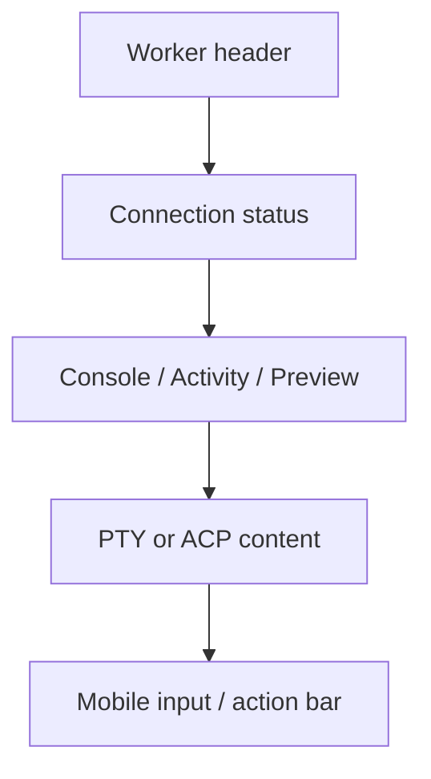

# 前端详细设计

## 1. 信息架构

新增移动路由：

```text
/{org}/mobile/workers
/{org}/mobile/workers/{podKey}
/{org}/mobile/workers/{podKey}/preview
```

旧 `/mobile/pods/{podKey}` 推荐限期 `308` 到新路径，不保留双页面。
兼容窗口和回收条件见实施文件映射，并需在设计批准时确认。

## 2. 桌面入口

每个 Worker 提供可见入口：

- Worker 标题栏手机图标
- Worker 行尾操作菜单
- 右键菜单作为补充

弹窗内容：

- Worker 名称和状态
- QR
- 可复制 canonical URL
- Console/Preview 入口
- 云端/局域网模式说明
- 当前模式可用性
- “二维码不包含访问密钥”安全提示

本地 `localhost` 页面不得直接生成不可达二维码。Descriptor API 未返回
canonical URL 时，弹窗展示“当前环境没有可供手机访问的地址”。

## 3. 移动 Worker 列表

`MobileWorkerListPage` 展示：

- active、queued、paused、terminated 分组
- Worker 名称、类型、交互模式
- Runner 在线状态
- 当前任务摘要
- Preview 可用性
- 最近活动时间

主要动作：

- 打开控制台
- 打开 Preview
- 创建 Worker
- 向离线 Runner 下发任务

Phase 1 可只交付前两项；未交付功能不得显示空按钮。

## 4. 单 Worker 工作区



Header：

- 返回 Worker 列表
- Worker 名称
- Runner/Pod 状态
- 更多菜单

状态条：

- connecting
- waiting_for_runner
- waiting_for_snapshot
- connected
- observing
- controlling
- reconnecting
- failed

## 5. PTY 移动交互

复用 `TerminalPane`、`useTerminalConnection`、`useTerminalResize` 和 Rust
RelayConnectionPool，不复制 xterm 或连接状态。

补充移动专属呈现：

- 固定快捷键工具条
- Ctrl、Alt、Esc、Tab、方向键
- 中文 IME 输入
- 横竖屏重新 fit
- Safe Area
- 触控滚动与文本选择模式
- 控制租约状态

`MobilePodWorkspace` 不应只隐藏桌面 Header；它应组合共享终端能力与
移动布局组件。

## 6. ACP 移动交互

复用共享 ACP store 和 command API，移动布局包含：

- 对话时间线
- 当前计划和任务状态
- permission/elicitation 卡片
- composer
- interrupt/cancel
- mode/model 信息
- reconnecting 和 snapshot 恢复

危险授权按钮必须保持原有语义，不能为了移动布局自动批准。

## 7. Preview

Preview 页面不使用 iframe bootstrap：

1. 调用 `CreatePreviewSession`。
2. 收到 `session_url`。
3. `window.location.replace(session_url)`。

这样避免浏览器返回时重复请求一次性 Token，也规避 iOS 第三方 Cookie
限制。Preview 页面失败时返回 Worker 控制台并展示错误码。

## 8. 状态所有权

| 状态 | 所有者 |
|---|---|
| Pod/Worker 业务状态 | Rust Core |
| Relay 连接和 Snapshot | Rust RelayConnectionPool |
| ACP authoritative state | Rust/WASM ACP manager |
| 当前页面 Tab | React local state |
| QR 弹窗开关 | React local state |
| Access Descriptor | API query cache |
| Control lease | Relay state + Rust projection |

禁止把 Pod、Relay 或 ACP 业务状态复制进新的 Zustand mobile store。

## 9. 组件边界

建议组件：

```text
components/mobile-worker/
  MobileWorkerList.tsx
  MobileWorkerWorkspace.tsx
  MobileWorkerHeader.tsx
  MobileConnectionStatus.tsx
  MobileTerminalToolbar.tsx
  MobileAcpWorkspace.tsx
  MobileAccessDialog.tsx
  MobileAccessModeSelector.tsx
```

共享 hooks：

```text
hooks/useMobileAccessDescriptor.ts
hooks/useWorkerControlLease.ts
```

文件必须按单一职责拆分并保持项目行数限制。

## 10. 页面状态验收

每个页面必须真实渲染并验证：

- loading
- empty
- permission denied
- Runner offline
- Relay unavailable
- waiting for snapshot
- reconnecting
- read-only observer
- control lease conflict
- Preview disabled
- Preview tunnel unavailable

错误信息必须可操作，包含“重试”“返回列表”或“检查 Runner”之一。

## 11. PWA 与性能

Phase 1 使用现有 PWA，不新增原生 App。移动工作区仍需要 WASM，因此保留
Wasm-bound layout。必须测量：

- 首次加载 WASM
- 登录后深链恢复时间
- 首个 Snapshot 时间
- 后台恢复时间

后续可为移动路由做独立轻量 bootstrap，但不得建立第二套状态实现。
