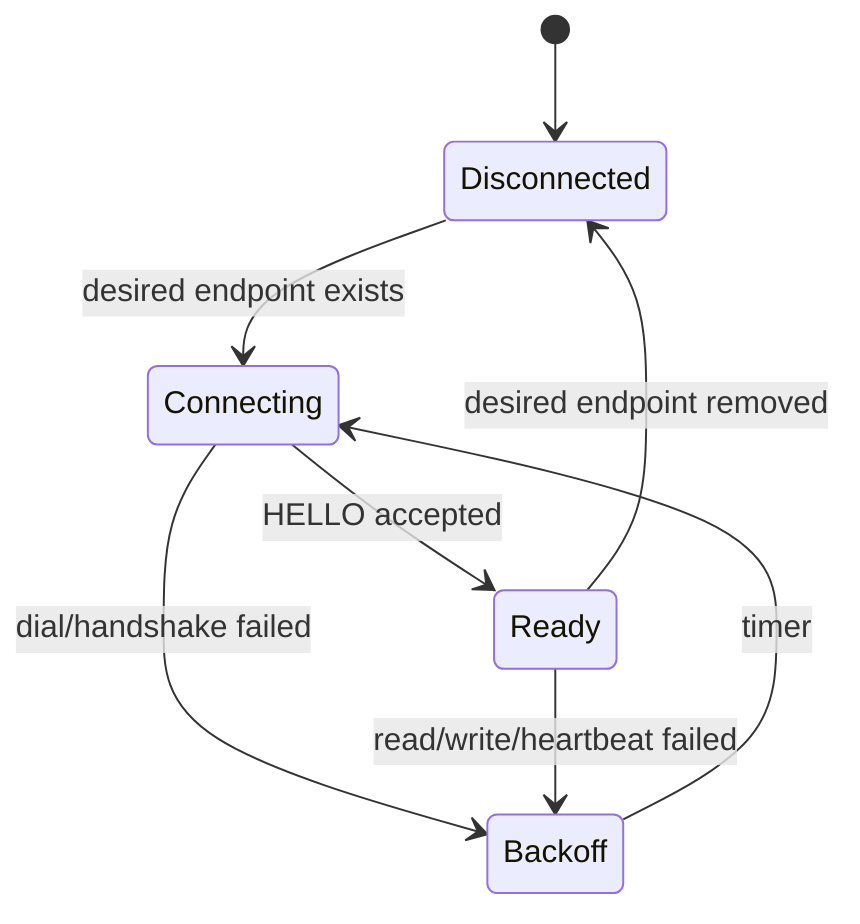

# Backend、Relay 与 Runner 设计

## 1. Backend 职责

Backend 是移动接入控制面的唯一入口：

- 解析 Org scope
- 验证 Pod read/control 权限
- 返回无密钥 Access Descriptor
- 选择用户显式指定的 Relay
- 确保 Runner publisher/tunnel 已建立
- 签发短期 typed JWT
- 记录连接和控制租约审计

## 2. Access Descriptor Service

建议新增：

```go
type MobileAccessService struct {
    pods   PodReader
    relays RelayRegistry
    policy PodAuthorizer
    urls   PublicURLResolver
}
```

核心流程：

```go
func (s *MobileAccessService) Describe(ctx context.Context, req Request) (Descriptor, error) {
    pod := s.pods.GetByKey(ctx, req.PodKey)
    s.policy.RequireRead(ctx, pod)
    candidates := s.relays.CandidatesForRunner(ctx, pod.RunnerID)
    canonicalURL := s.urls.MobileWorkerURL(req.OrgSlug, pod.PodKey)
    return NewDescriptor(pod, candidates, canonicalURL), nil
}
```

`PublicURLResolver` 必须来自受控配置和请求域名策略，不读取浏览器传入的
任意 Host，也不猜测 LAN IP。

## 3. GetPodConnection 修正

当前逻辑必须从 fail-open 改为 fail-closed：

```go
runnerToken := tokens.NewRunnerRelayToken(...)
if err := sender.SendSubscribePod(...); err != nil {
    return unavailable("runner_subscribe_failed", err)
}
browserToken := tokens.NewBrowserRelayToken(...)
return connectionInfo(...)
```

`commandSender == nil`、`RunnerID <= 0` 或 Relay 不健康都返回明确错误。

建议增加 Runner publisher ready 确认，避免 Send channel 写入成功但 Relay
尚未可用：

1. Backend 发送 `SubscribePod(command_id)`。
2. Runner 建立 publisher。
3. Runner 上报 `RelaySubscriptionReady`。
4. Backend 在短超时内等待确认。
5. 成功后签发 Browser Token。

## 4. Preview 配置

Preview 应成为 Worker 配置的一部分：

```protobuf
message PreviewConfig {
  int32 port = 1;
  string path = 2;
}
```

写入路径：

- Worker 创建时配置
- Worker settings 更新
- Pod config revision

验证：

- `port == 0` 表示禁用
- 启用时 `1024 <= port <= 65535`
- path 必须以 `/` 开头
- path 规范化后不得包含 `..`
- host 固定为 `127.0.0.1`

## 5. Preview Session Service

建议将现有 Handler 逻辑下沉：

```go
type PreviewSessionService struct {
    pods     PodReader
    relays   RelayRegistry
    tunnels  TunnelCoordinator
    tokens   TypedTokenIssuer
}
```

流程：

1. 验证 Pod 和权限。
2. 解析并验证 PreviewConfig。
3. 选择显式 Relay。
4. `EnsureTunnelReady`。
5. 绑定 target + normalized path 签发 Token。
6. 返回 `session_url`，不返回裸 Token。

`TunnelCoordinator == nil` 必须报配置错误，不得跳过。

## 6. Tunnel Ready 与重连

Runner Tunnel Client 改为持久状态机：



要求：

- 指数退避 + jitter
- Token 到期前刷新
- 10 秒 ping
- 30 秒 pong timeout
- 重连后重新 HELLO
- 连接代次隔离，旧 read loop 不得覆盖新状态
- Backend 可查询 tunnel ready 状态

## 7. Preview Path 处理

Token claim 增加 normalized path。Relay 收到：

```text
/preview/{podKey}/assets/app.js
```

生成上游路径：

```text
join(preview_path, "/assets/app.js")
```

必须使用结构化 URL path join，禁止字符串替换 HTML。对 Location、Cookie
Path 和 WebSocket upgrade 做明确代理规则。

## 8. Relay 控制租约

Relay channel manager 增加单写者租约：

- `AcquireControl`
- `RenewControl`
- `ReleaseControl`
- `ControlStatus`

租约消息走 Control frame，不改变 PTY/ACP payload：

```json
{"type":"control_lease","action":"acquire","client_id":"..."}
```

Relay 在处理 Input、Resize 和 ACP Command 前验证租约。连接关闭时释放。

## 9. 依赖注入门禁

以下依赖缺失必须启动失败或请求失败：

- Relay registry
- Token issuer
- Runner command sender
- Tunnel coordinator
- Public URL resolver

禁止通过 nil check 跳过关键安全或编排步骤。
