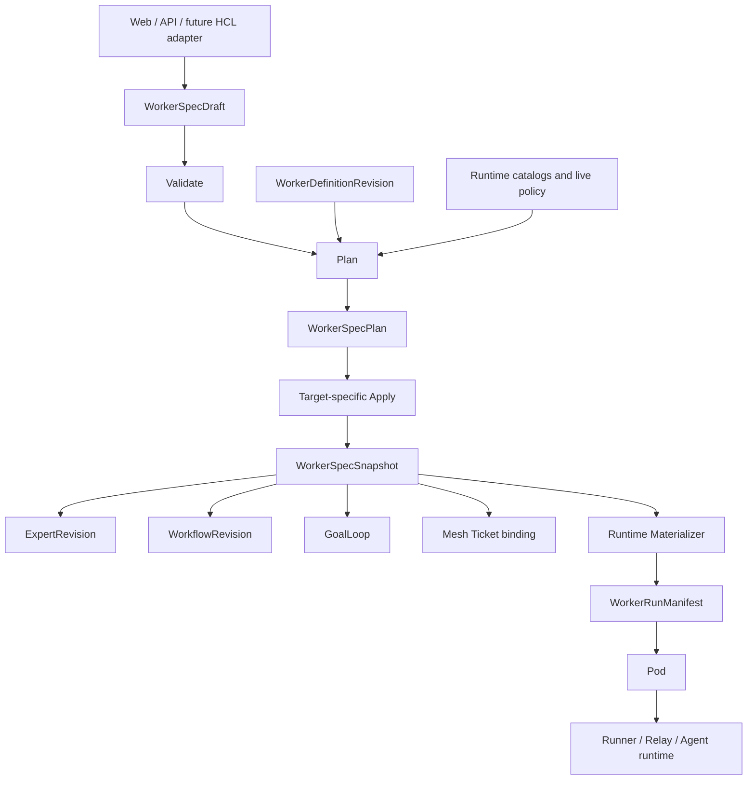

# Target Architecture

## Control and Data Planes

The backend is the control plane. Runner and Relay remain the execution and
terminal data plane. No local `.tfstate` equivalent is introduced.

## Source-of-Truth Hierarchy

| Layer | Authority | Mutability |
| --- | --- | --- |
| WorkerDefinitionRevision | Worker harness contract and base AgentFile | Immutable content |
| WorkerSpecPlan | Proposed resolved configuration | Immutable, expiring |
| WorkerSpecSnapshot | Applied reusable configuration intent | Immutable |
| ExpertRevision / WorkflowRevision | Product version referencing a snapshot | Immutable |
| WorkerRunManifest | Effective configuration for one Pod | Immutable |
| Pod | Lifecycle and observed execution state | Mutable state machine |
| Agent projection | Query and display projection | Rebuildable |
| Git backing | Distribution and inspection projection | Rebuildable |

No lower row may reconstruct or override a higher row's business meaning.

## Component Boundaries

### WorkerDefinition Registry

Loads current bundles from Git-controlled files and persists content-addressed
revisions. It exposes exact lookup by `definition_hash`.

The current catalog selects which revisions are offered for new plans.
Historical snapshots continue resolving retained revisions unless live policy
revokes them.

### WorkerSpec Validator

Performs deterministic normalization and schema checks. It cannot query
capacity, decrypt credentials, persist records, or select a Runner.

### WorkerSpec Planner

Resolves organization-scoped references, exact resource revisions,
compatibility, authorization, and policy. It emits blocking issues, advisory
warnings, a canonical proposed snapshot, dependency manifest, compiled
WorkerSpec AgentFile layer, and stable plan hash.

### Target Apply Services

Consume a non-expired plan and perform one business action:

- create and run a Worker;
- publish a new Expert revision;
- create or revise a Workflow;
- create a GoalLoop;
- bind a Mesh Ticket.

They do not accept duplicate legacy runtime fields.

### Runtime Materializer

Loads an applied snapshot and its exact WorkerDefinition revision, rechecks
live authorization and revocation, resolves scheduling and mutable external
state, and persists one WorkerRunManifest before dispatch.

### Projection Services

Agent database rows and Expert Git repositories are projections. Projection
failure is visible and retryable, but cannot silently change runtime behavior.

## Configuration Layers

The effective AgentFile is assembled in this fixed order:

1. exact WorkerDefinition revision base AgentFile;
2. exact compiled WorkerSpec layer stored with the snapshot;
3. typed invocation layer containing only allowed per-run inputs;
4. current system policy overlay, which may only preserve or restrict access.

User preferences may prefill explicit draft fields. The planner and runtime do
not load hidden preferences that are absent from the submitted draft.

## Allowed Invocation Overrides

The runtime API permits only fields that do not redefine Worker capability:

- display alias;
- prompt or rendered Workflow task input;
- Ticket, WorkflowRun, or GoalLoop correlation IDs;
- terminal dimensions;
- explicit resume source;
- idempotency key.

Model, Worker type, image, repository, Skills, knowledge, environment bundles,
automation, interaction mode, and lifecycle cannot be overridden.

## Availability Versus Immutability

An immutable snapshot can be unavailable for execution. Expected blocking
conditions include:

- WorkerDefinition revision explicitly revoked;
- model resource or connection revoked;
- secret reference no longer authorized;
- repository access removed;
- Skill or knowledge revision removed by retention policy;
- compute target disabled or lacking capacity;
- organization quota exceeded.

These are explicit live-policy failures. They do not authorize reconstruction
from current defaults or legacy fields.
