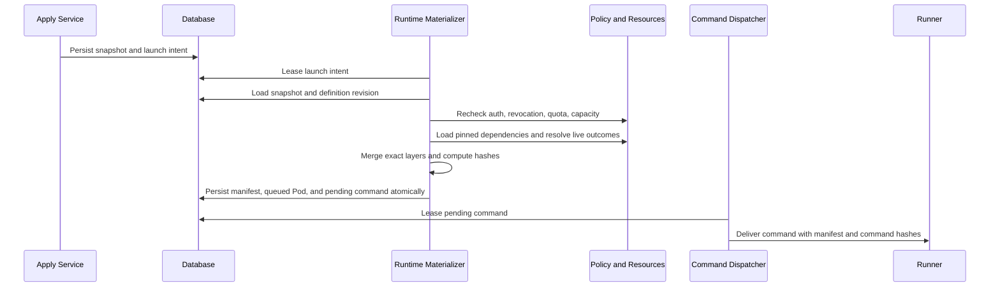

# Runtime Materialization

## Purpose

Runtime Materializer converts one applied WorkerSpec snapshot and one typed
invocation into one immutable WorkerRunManifest and one Pod dispatch request.
It is the only fresh execution path.

## Materialization Sequence

Materialization failure terminates the launch intent without a Pod. Dispatch
starts only from the durable command record. Crashes and delivery failures are
recovered by leases and idempotent retry.

## Pinned Inputs

Materialization must load exact pinned content:

- WorkerDefinition revision by hash;
- runtime image digest;
- WorkerSpec compiled AgentFile layer and hash;
- model resource and connection revisions;
- typed config values and secret reference identities;
- exact Skill and knowledge revisions;
- environment bundle reference revisions;
- requested placement and resource profile.

It must not compare the snapshot to the current WorkerDefinition revision or
substitute current dependency revisions.

## Live Checks

The following remain live:

- tenant authorization and grants;
- WorkerDefinition revocation policy;
- model and connection revocation;
- secret access and rotation state;
- repository access;
- compute target health and capacity;
- organization quotas;
- current security policy.

Live checks may block or restrict a run. Materializer resolves concrete Runner,
branch HEAD for branch policy, and secret rotation version, but it cannot
replace pinned non-secret revisions with current defaults.

## Workspace Resolution

Repository configuration declares a ref policy:

- `branch`: resolve current branch HEAD and record commit SHA;
- `commit`: require the exact commit;
- `none`: no repository.

The run manifest records repository ID, normalized clone target, ref policy,
requested ref, and resolved commit. Normalized clone targets must not contain
embedded credentials.

Skill, knowledge, and environment dependencies record the exact revisions or
digests mounted for the run. If the platform cannot currently provide versioned
content for a dependency type, that capability must be added before claiming
byte-identical replay.

Compiled AgentFile references use stable identifiers, never display names.
Environment bundles that currently compile by mutable name require a stable
slug or an ID-backed runtime binding before cutover.

## AgentFile Assembly

The materializer parses and merges four typed layers:

1. retained WorkerDefinition base AgentFile;
2. stored WorkerSpec compiled layer;
3. generated invocation layer;
4. generated system policy layer.

Every layer is parsed before merge. The final program is serialized
canonically. The manifest stores layer hashes and final hash.

Unknown declarations, duplicate incompatible fields, malformed JSON-derived
values, and missing references fail materialization.

## Policy Overlay

System policy is monotonic:

- it may disable capabilities;
- lower automation permissions;
- restrict network, filesystem, tool, model, or resource limits;
- require approval checkpoints;
- block execution.

It cannot silently raise permissions, change Worker type, switch models, or
select a different repository. The applied policy revision and canonical
overlay are recorded in the run manifest.

## Secret Handling

The backend resolves authorization and sends only the minimum runtime secret
material through existing protected channels. Persistence contains:

- secret kind and stable ID;
- metadata revision;
- target environment or config-document binding;
- optional non-sensitive rotation version.

Logs, events, plans, snapshots, manifests, and AgentFile source never contain
decrypted values.

Per-run prompt content is stored in the protected Pod or task payload store
under its retention policy. RunManifest stores only its hash and correlation
reference, not plaintext prompt content.

## Placement

WorkerSpec records placement intent and immutable resource limits. Runtime
Materializer selects a concrete eligible Runner or dedicated target and records
the result.

Automatic placement is an explicit policy selected in WorkerSpec. It is not a
fallback after an explicit target fails.

## Resume

Resume loads the source Pod snapshot and run manifest.

- runtime identity, workspace, and session state come from the source manifest;
- current authorization and revocation are checked again;
- current policy may add stricter restrictions and is recorded as a new resume
  manifest;
- user preferences and current Worker defaults are not merged;
- incompatible source state blocks resume with a concrete error.

Fork creates a new manifest linked to the source manifest. A configuration
change requires a new WorkerSpec plan and snapshot.

## Observed State

Pod remains the lifecycle SSOT for queued, running, waiting, terminated, and
failed states. WorkerRunManifest is configuration evidence and is never updated
to mirror Pod status.
